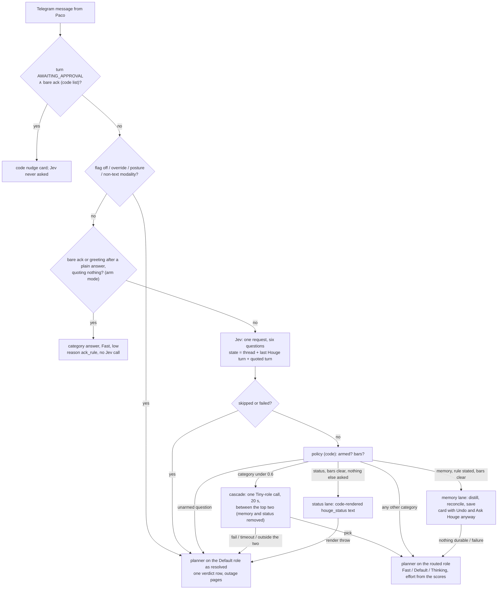

# Jev decision layer (ADR 0029)

Reference for the System One layer as of the stage A decision tree: where Jev sits, how a turn is routed, how to read
what it logged, how to arm it and how to roll it back. Design: [ADR 0029](../decisions/0029-jev-system-one.md) and
[the decision-tree spec](../superpowers/specs/2026-10-06-jev-decision-tree-design.md) (Rev 9). Flags, events, tables and
the CLI: [configuration.md](configuration.md#jev-system-one-adr-0029); model roles:
[configuration.md § Model roles](configuration.md#model-roles). Stage A is built; the `answer`, `lookup`, `schedule` and
`wiki` lanes (stages B and C) are specified, not built.

Jev answers typed questions and cannot generate text. **Code** applies every bar and falls through to the Default role on
any doubt; the **models** compose inside whichever lane or role code picked. Jev may add caution, never remove it, and
never gates an action.

## Decision flow

Every Telegram text turn passes one decision point: state, then six questions in one Jev request, then a pure policy.

A lane is a handler whose control flow is code (one one-shot compose at most). Any lane failure falls through to the
planner; the planner is the floor. Memory and status are the only lanes in stage A.

## State and questions

The state is code-observed facts only (nothing model-authored): the latest message, the recent thread, the modality, the
last Houge turn's kind (`answer`, `clarify` or `proposal`, computed at read time), and the **quoted turn** when the message
is a Telegram reply that resolves to a stored turn. Egress is the lane 1 envelope: latest message at most 8 000 chars,
the whole request at most 24 000, every field sanitised and broker-redacted, and an oversized state is skipped, never
truncated.

| Question | Type | Answers |
|---|---|---|
| `category` | choice | `answer`, `lookup`, `research`, `memory`, `self_change`, `machine_task`, `schedule`, `wiki`, `mail_calendar`, `status`, `other` |
| `sets_rule` | noul | does the message state a rule to follow from now on |
| `rule_scope` | choice | `ask` or `research` (read only when `sets_rule` is yes) |
| `breadth`, `reasoning`, `actions` | score | expected levels; the highest is the gear, `reasoning` sets the effort |

## Bars

All bars are code (`TREE_BAR_DEFAULTS`, `src/jev/tree-policy.ts`), stamped on every decision row as the threshold
version. There is no env override.

| Decision | Bar |
|---|---|
| any `choice` | p of the top option at least 0.6; below it, the cascade |
| `noul` (`sets_rule`) | yes at 0.8 or more, no at 0.2 or less, between is unsure (unsure is no: nothing saved) |
| `memory` lane | p at least 0.85, confidence at least 0.7, gap to the runner-up at least 0.5 |
| `status` lane | p at least 0.8, the same confidence and gap floors, and `rule` armed |
| gear | the highest score: up to 1.2 Fast, below 2.5 Default, otherwise Thinking |
| `rule_scope` | overrides its category's default scope (`research` for research, else `ask`) only at 0.6 or more |

Role floors per category: `answer` and `lookup` Fast, `research` Thinking, `self_change`, `machine_task`, `schedule`, `wiki`,
`mail_calendar` and `other` Default. The route takes the higher of the gear and the floor. `think harder`, `认真想` or
`ultrathink` in the message sends the turn to Thinking.

Guards: a bare ack never reaches a lane (`bare_ack_guard`); a memory turn that is a correction (a rule not stated) goes to
the planner and saves nothing; a rule stated inside a status question is saved and the planner answers, since the status
lane is "nothing else".

## The cascade

When `category` is under 0.6, one one-shot on the **Tiny role** (`LlmCallRole` `cascade`) picks between Jev's top two
categories after `memory` and `status` are removed, so a model guess can never route into a no-planner lane. If only one
category remains it is taken without a call. The whole pick is bounded at **20 s** on the user's path (the omp legs carry
an 18 s chain deadline inside it). The answer is parsed as an exact token (quotes, backticks and a final full stop
stripped, case folded). A failure, a timeout or an answer outside the two means the planner on Default and **nothing
saved**. The verdict's `cascade` value is `tiny` whenever the call was made (the Tiny leg that answered is on the
`llm_attempt` row), and the `triage` event names the pair as `cascade_between`. Shadow mode makes no call.

## Corrections

`jev_verdicts.paco_correction` records the first correction on a verdict: `think_harder` (the next message), `escalation`,
`low_rating`, or `ask_anyway` (the **Ask Houge anyway** tap, which overwrites). The ratings table and the
`routed_escalation` and `triage_override` events keep the rest.

## Reading a `triage` row

Every eligible Telegram turn gets exactly one `triage` event and one `jev_verdicts` row, written in one transaction, so
the events are the denominator for any rate. Payload fields (ids, enums and numbers only; never message text):

| Field | Meaning |
|-------|---------|
| `status` | `answered` (Jev replied) or `skipped` (no usable answer, or no call was made). |
| `skip_reason` | Only when skipped: `no_key`, `fused`, `auth`, `rate_limited`, `overloaded`, `malformed_question`, `timeout`, `parse`, `transport`, `state_too_large`, `disabled`, `posture`, `modality`, `override`, `ack_rule` or `error`. |
| `category`, `route_lane`, `role` | What the tree routed: the category (null on a fallback), `memory` / `status` / `planner`, and Fast / Default / Thinking. |
| `verdict_id` | The `jev_verdicts` row; the turn's first routed model call carries it as `routed_by`. |
| `confidence`, `top_prob`, `margin` | Numbers from the `category` answer. Code compares them to the bars; Jev never does. |
| `lang` | `zh`, `en` or `mixed` (mixed uses the zh calibration). |
| `decision` | `act` (the route took effect), `shadow` (rows only) or `fallback` (the Default route; always the value for a skip, except `ack_rule`). |
| `verdict` | The route reason: `routed`, `uncalibrated`, `below_bar`, `bare_ack_guard`, `correction`, `cascade`, `cascade_failed`, `ack_rule` or `jev_skipped`. |
| `cascade_between` | Only when the cascade ran: the two category enums. |

Read order: `status` first (a skipped row means Jev played no part), then `decision` and `verdict` (did anything act, and
why not), then the numbers. Per-question probabilities, thresholds and the criteria hash are in the `jev_decisions` rows
for the same run. The verdict row's three outcomes say what happened after the route: `save_outcome` (a rule saved or
not), `route_outcome` (`act`, `fallback`, `pin_failed`) and `handler_outcome` (`lane_reply`, `fallthrough:*`, or
`planner_done` / `planner_failed` once the run ends; never left `pending`). A status render that throws settles as
`fallthrough:render_failed` with route outcome `fallback`.

Rows key on the model Jev **reports**, not the one requested: every request names the moving alias `jev-latest`. When
TypeSafe moves the alias, the reported id has no row, so every question falls to uncalibrated (Default route) until Paco
commits rows for the new id. In `arm` mode the first such answered call opens a `jev_model_uncalibrated` incident and pages
once per model.

## Arming

**Armed 2026-10-09.** `CALIBRATED_ROWS` (`src/jev/calibration.ts`) holds 14 rows: the six tree questions plus
`category:status`, zh and en, on the model Jev reported. Evidence: 301 replayed turns, 111 labelled by Paco, no turn
misrouted into a lane (memory 7/7, status 2/2), category agreement 181/301, option-order agreement 276/301; the known
weakness is research read as lookup (26 of 59). Without rows for the reported model **nothing is armed**: every turn
routes `uncalibrated` to the planner on Default, and the memory and status lanes do not act. The sequence (for a new
model or a criteria change) is build, then
`houge jev replay triage` on a DB copy (a `--dry-run` first for the cost; it must run on a copy, because opening the DB
with a branch's code applies that branch's migrations), plus `--permute`, then `houge jev label triage` (one category per
turn: every memory or status candidate plus a random sample), then Paco reads the report's per-combination lines and
commits rows for the decisions he chooses, then `node scripts/live-gate-jev-tree.mjs --real-calibration` must
PASS with both lanes acting, then merge and kickstart.

Each decision arms on its own rows. Couplings to decide at commit time:

- The **memory lane** needs `category` and `rule` (`sets_rule` plus `rule_scope`); the **status lane** needs
  `category:status` and `rule`, so a stated rule is never swallowed by a code reply.
- **Arming `category` alone already moves turns off Default**: research runs on Thinking and the Default-floor categories
  on at least Default, even with `gear` unarmed. "Lane parity only" (memory and status, no model change) is not available.
- `gear` arms the three scores together; unarmed, the route takes the category's floor.

The disarm marker (`houge.jev-disarmed`, written when `triage_overrides` fires) caps `arm` at `shadow`, which arms nothing:
the Default route, exactly as it capped lane 1. **Failure is Default as resolved**: any Jev failure, skip, unarmed
question or thrown stage runs the planner on the Default role (a `/models` override included), with one verdict row. The
ack rule is the only path that acts without a Jev call, and only in `arm` mode.

## Rolling back

Two levels, from the milder to the full:

1. **Model-list rollback** (`.env`, then `launchctl kickstart -k gui/$(id -u)/com.houge.daemon`): set
   `HOUGE_JEV_TRIAGE_ENABLED=off` and `HOUGE_MODEL_ROLES=static`. `off` writes one verdict row per turn and attaches no
   route, so the supervisor pins nothing and `think harder` is ignored; `static` runs today's seven chains as written,
   with no catalog, no override and no tick. This is **not** today's supervisor exactly. Three differences remain:
   (a) a selector the running child refused is skipped for that child's life; (b) the respawn onto the planner's head at the
   next turn is gone (`set_model` moves the live child); (c) while Jev is on, a routed turn may step up a role and retry
   `other` once (with `off` there is no route, so (c) does not apply). The memory and status lanes do not act while the flag
   is off.
2. **Restore lane 1 itself**: `git revert` the stage A merge commit(s) on `main`, `npm run build`, kickstart. The
   `jev_verdicts` table and the `chat_turns.quoted_turn_id` column stay (additive migrations the old code never reads), and
   lane 1's `CALIBRATED_ROWS` come back with the revert.

For a live kill with no restart, `/disarm` forces `HOUGE_JEV_ENABLED` off and the disarm marker caps the tree at shadow.

## Failure and the sweep

A broken lane or a silent Jev outage must reach Paco:

- Every Jev outage class pages (`jev_auth`, `jev_rate_limited`, `jev_overloaded`, `jev_question_invalid`, `jev_no_key`,
  `jev_model_uncalibrated`), and the next answered call resolves it.
- `jev_skip_rate`: half or more of at least 3 triage calls in 24 h failing silently. `ack_rule` skips are not calls.
- `lane_fallthrough_rate`: half or more of at least 3 settled turns of one lane (memory or status) in 24 h falling through
  to the planner. A fall-through is a verdict whose handler outcome starts `fallthrough:` or a lane turn closed
  `planner_done` / `planner_failed`.
- `role_unresolved` and `model_catalog_unavailable` (the model-role side, [configuration.md](configuration.md#model-roles)).

## User-visible gaps

- **Silence during the memory lane.** The lane takes about 15 to 25 s. The chat shows nothing in that time, and messages
  sent meanwhile are queued, not steered.
- **A cascade can add up to 20 s.** A below-bar turn waits for the Tiny pick before the planner starts. A slow Tiny leg
  (Kimi measured 13 s on the live gate) eats most of the bound; the failure path costs nothing but the wait.
- **A memory rule that also needs a tool.** The lane cannot do both. A rule stated alongside a lookup is saved first and the
  planner then answers with a `[memory]` note; "Ask Houge anyway" re-runs a turn the lane took on its own.
- **A fast lane can stop a starting planner child.** The planner child starts in parallel with the Jev call. If a lane
  finishes while it is still starting, the child is stopped after 5 s, and the next turn pays a cold start.

## Behaviour changes outside the lanes

- **One saved lesson per turn, planner-only turns included.** The already-saved guard is set by any committed save, the
  planner's own `lesson_write` included. A second `lesson_write` in the same turn gets `already_saved_this_turn` and spends
  nothing.
- **Step-up skips what already failed.** A routed turn that spends its role steps up (Fast to Default to Thinking), but
  the step-up chain excludes selectors that failed this turn with a non-`other` error: a stronger answer is the point, not
  a retry of a provider that just failed. An emptied chain ends `no_planner_leg` as before.
- **The omp version check no longer blocks the event loop.** It is async on the spawn path. Before, `execFileSync` held
  the loop for about 0.8 s on every spawn and starved the concurrent 1.5 s Jev call (5 of 9 Jev calls timed out on the
  first live gate run); after, 0 of 9.

## Deviations from the spec

The Jev client is built per call, not once at boot (cheap; the broker key is read each time), so `jev_no_key` opens on the
first armed turn rather than at boot. `shadow` is mostly a legacy flag value now: it arms nothing, so every shadow verdict
reads `uncalibrated` with `category` null. The status lane applies lane 1's confidence and gap floors, which lane 1
applied to memory only (stricter, toward the planner). Recorded in the ADR 0029 amendment and the spec's Rev 9 entry.
