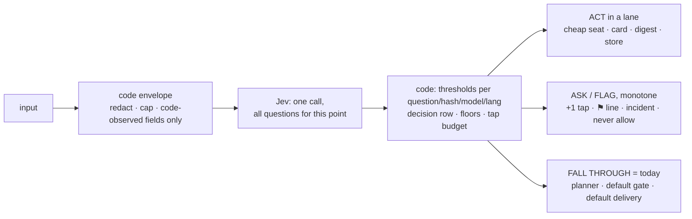

# Jev decision layer (ADR 0029)

Reference for the System One layer: where Jev sits, what each lane does, how to read what it logged, and what a
user can see. Design: [ADR 0029](../decisions/0029-jev-system-one.md) and
[the spec](../superpowers/specs/2026-10-04-jev-system-one-design.md). Flags, events, tables and the CLI:
[configuration.md](configuration.md#jev-system-one-adr-0029). Lane 1 is built; lanes 2 to 5 are specified but not built.

Jev answers typed questions and cannot generate text. **Code** applies the thresholds and falls through to today's
behaviour on any doubt; the **models** compose inside whichever lane code picked. Jev may add caution, never remove
it, and never gates an action.

## Decision flow

The first diagram is lane 1 as specified. The `ROUTE` branch belongs to lane 2 and is not built, so today the
`MEM -- no` path goes straight to the planner on its default chain.

```mermaid
flowchart TD
  M[Telegram message from Paco] --> AP{"submit(): turn AWAITING_APPROVAL<br/>∧ bare ack (code list)?"}
  AP -- yes --> NUDGE[code nudge card:<br/>tap Approve or /approve id<br/><i>not steered, not queued, Jev never asked</i>]
  AP -- "no (queued turn → startTurn)" --> PRE{posture non-null<br/>or photo turn?}
  PRE -- yes --> TODAY
  PRE -- no --> JEV[Jev, one call ≤ 1.5 s, awaited;<br/>child spawn started, not awaited<br/>lane · complete · scope]
  JEV --> FAIL{Jev skipped: no key / 429 /<br/>timeout / disabled …?}
  FAIL -- yes --> TODAY[ledger row + incident<br/><b>today's path</b>: await spawn, planner on default chain]
  FAIL -- "lane = status ≥ .80" --> STATUS[code-rendered houge_status text<br/><b>no planner turn</b>]
  FAIL -- no --> MEM{lane = memory ∧ conf ≥ .70<br/>∧ p(memory) ≥ .85 ∧ gap ≥ .50?}
  MEM -- "yes, p(pure) ≥ .80" --> LANE[memory lane on ticks seat:<br/>distill → reconcile → save]
  LANE -- saved --> CARD[📒 card · Undo · Ask Houge anyway<br/><b>no planner turn</b>]
  LANE -- nothing durable --> ROUTE
  MEM -- "yes, mixed" --> LANE2[memory lane saves;<br/>already-saved guard armed] --> NOTE["planner turn with<br/>[memory] lesson #N saved; do not save again"] --> ROUTE
  MEM -- no --> ROUTE{"planner seat by complexity<br/>(lane 2: turn-owned chain)"}
  ROUTE -- "hard ≥ .70" --> OPUS[anthropic/claude-opus-5-5:medium<br/>→ antigravity/claude-opus-4-6 → kimi]
  ROUTE -- "routine ≥ .70" --> KIMIM[kimi-code/k3:medium<br/>→ antigravity/gemini-3.1-pro:medium]
  ROUTE -- "trivial ≥ .80" --> KIMIL[kimi-code/k3:low<br/>→ antigravity/gemini-3.1-pro:low]
  ROUTE -- abstain --> DEF[default: Opus chain in month one;<br/>flips to the routine chain once hard-recall ≥ 97%]
  KIMIM -. "think harder / 认真想 / ultrathink,<br/>model error or refusal" .-> OPUS
  KIMIL -. same escalation .-> OPUS
```

The generic layer under every lane:



| Lane | input | act | ask / flag | fall through |
|---|---|---|---|---|
| 1 memory | Paco's message | save lesson, card | — | planner |
| 2 routing | Paco's message | pin the seat chain for this turn | — | default chain |
| 3 security | wall output / plain shell command | — | ⚑ taint line / extra tap | today's gate |
| 4 inbound | report / incident / mail | digest, store | ping now | today's delivery |
| 5 context | Paco's message | shadow: credit only | — | credit all, as today |

## Reading a `triage` row

Every eligible Telegram turn gets exactly one `triage` ledger event once its outcome is known, so the events are the
denominator for any rate. Payload fields (ids, enums and numbers only; never message text):

| Field | Meaning |
|-------|---------|
| `status` | `answered` (Jev replied) or `skipped` (no usable answer). |
| `skip_reason` | Only when skipped: `no_key`, `fused`, `auth`, `rate_limited`, `overloaded`, `malformed_question`, `timeout`, `parse`, `transport`, `state_too_large`, `disabled`, `posture`, `modality`, `override` or `error`. |
| `lane` | Jev's `lane` choice: `memory`, `status` or `none`. `null` when skipped. |
| `complete` | `pure` or `mixed`: whether the message is only a memory instruction. |
| `scope` | `ask` or `research`: which kind of lesson. |
| `confidence`, `top_prob`, `margin` | Numbers from the `lane` answer. Code compares them to the bars; Jev never does. |
| `lang` | `zh`, `en` or `mixed` (mixed uses the zh calibration). |
| `decision` | What code did: `act` (the lane ran), `shadow` (rows only), or `fallback` (today's path; always the value for a skip). |

Arming is per lane: the status lane arms only on its own `lane:status` calibration row, and the memory lane only on
the `lane`, `complete` and `scope` rows together, so neither implies the other
([ADR 0029 build notes](../decisions/0029-jev-system-one.md#build-notes-2026-10-06-lane-1-built-on-featjev-lane1-not-merged)).

Read order: `status` first (a skipped row means Jev played no part), then `decision` (did anything act), then the
numbers (how close was it). Per-question probabilities, thresholds and the criteria hash are in the `jev_decisions`
rows for the same run. A memory save adds `lesson_saved` (with its `change_id`), an Undo adds `lesson_change_undone`,
and "Ask Houge anyway" adds `triage_override`.

## User-visible gaps

- **Silence during the memory lane.** The lane takes about 15 to 25 s. The chat shows nothing in that time, and
  messages sent meanwhile are queued, not steered.
- **A mixed verdict that saves nothing.** When Jev says `mixed` but the save step finds nothing durable, the planner
  runs with no `[memory]` note, and it may spend a second distill and reconcile pair on the same message.
- **A fast lane can stop a starting planner child.** The planner child starts in parallel with the Jev call. If a lane
  finishes while it is still starting, the child is stopped after 5 s, and the next turn pays a cold start.

## Behaviour changes outside the lanes

- **One saved lesson per turn, planner-only turns included.** The already-saved guard is set by any committed save,
  the planner's own `lesson_write` included. A second `lesson_write` in the same turn now gets
  `already_saved_this_turn` and spends nothing, where before lane 1 it ran the pipeline again. The guard is re-checked
  just before the save transaction, so two parallel calls cannot both save.

## Deviations from the spec

The Jev client is built per call, not once at boot (cheap; the broker key is read each time), so `jev_no_key` opens on
the first armed turn rather than at boot. Both are recorded in ADR 0029.
