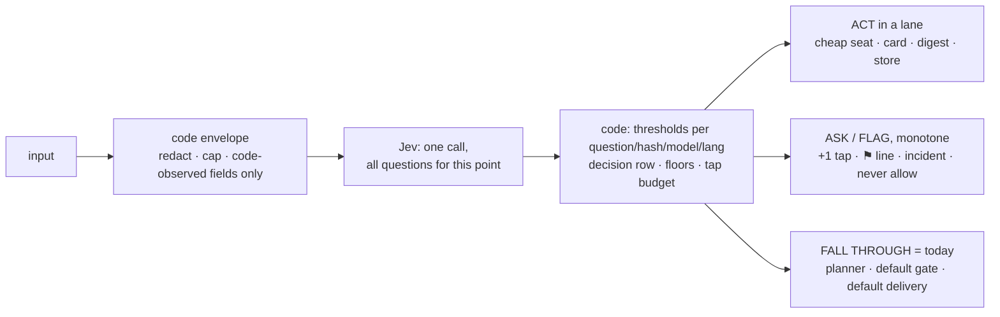

# Jev as System One — a typed decision layer in front of Houge's models

Date: 2026-10-04
Status: **Rev 2 — Paco's rulings on the open questions folded in (2026-10-04); under spec review (senior + Codex) before any code**

Rev 2 changes: §1.2 decision-flow diagram; §6.1 routing table rewritten to Paco's direction (trivial/routine → Kimi →
Gemini, hard → Opus; Codex stays the self-write writer only) with the D10 reader-family resolver and the Antigravity
ceiling watch; the six open questions closed with the defaults (see Rulings).
Author: Paco + Claude
Supersedes the scope of memory stage A2 ("Jev-first decision cascade", `docs/superpowers/specs/2026-10-02-memory-a1-fixes-design.md` §Non-goals): the memory lane is now lane 1 of a general layer, not a memory-only cascade.
Governs: ADR 0029 (new), amendments to ADR 0013, 0014, 0019; the AGENTS.md flat-rate line (Paco's hand).
Evidence: six research reports in `docs/superpowers/research/2026-10-04-jev-lanes/` (Jev capabilities, and one per lane). Every number below comes from those reports, the live DB (read-only, `houge.sqlite`) or the code at `main@6f52dea`.

The repo is public: this spec names memory rows by id only and quotes no personal message text.

## Why

Houge makes many small judgment calls per day: what kind of message this is, which model should answer it, whether a
lesson should be saved, whether a read page carries instructions, whether a notification is worth an interruption.
Today every one of them is either hard-coded or costs a full planner turn on Claude Opus 5.5 (the only seat that sees
the conversation). "好" after a proposal is a 189K-token Opus turn; a one-line preference ("以后别用敬语") is an Opus
turn that may or may not call `lesson_write`; a schedule report reaches Telegram with no urgency judgment at all.

Jev (TypeSafe System One, `jev-1.13.0`) answers typed questions — `choice`, `score`, `noul` — over a JSON state with
calibrated probabilities in ~0.3 s, for $0.042 per million input tokens, and cannot generate text. The 2026-09-26 replay
(374 turns) agreed with the LLM intent classifier 94.2% of the time at confidence ≥ 0.7. Paco's direction (2026-10-02,
restated 2026-10-04): Jev is the first decider for typed judgment calls across Houge, code owns the gates and the
thresholds, the generative models compose inside the lane Jev picked, and the code stays loose — few hand-coded
branches, one decision call per decision point.

The research changed the shape of three of the five lanes (see §2); this spec records what the numbers support, not what
the reference material promised.

## Goals

- One generic decision layer: a question library, one Jev call per decision point, code-owned thresholds, a decision row
  per call, an offline replay harness. Built once, reused by every lane.
- Lane 1 (memory) ships first and proves the layer end to end: a pure memory instruction from Paco is saved without an
  Opus turn and answered with a code-owned card.
- Jev can only add caution. It never produces `allow` or `deny`, never gates a security-bearing action, and every Jev
  failure yields today's behaviour.
- Thresholds come from replay evidence against labelled history, per question and per language, and re-enter shadow
  when the criteria text or the model version changes.
- Every Jev outage (401/403, 422, 429, 529) reaches Paco; none is folded into a silent retry.

## Non-goals

- Jev deciding reconcile verdicts (ADD/UPDATE/SUPERSEDE/DROP) for lessons or facts: separable in theory, but DROP leaves
  no row to calibrate against and reconcile already names the theme.
- Per-turn lesson or tool selection into the planner prompt: under omp lessons, skills and the tool manifest are
  session-level (written at child spawn); lessons are 2.4% of a 28.7k-token turn. Lane 5 is shadow-only (credit).
- `exfil_shape` through Jev: asking "is this a secret" would send the secret to TypeSafe. Stays code (credential-shape
  regex + entropy at the redact seam).
- A new "memory agent" process: `lesson_write` is already code plus two ticks-seat one-shots; the lane calls them.
- Fine-tuning Jev (not offered), local classifiers (embeddinggemma cannot read boundary rules; local LLMs are too slow
  on the 2018 mini), logprob classifiers (omp exposes none).
- SP2 itself. Lane 4 builds the envelope, digest and label SP2's poller will plug into; the poller is SP2.

## 1. Architecture

```
inbound (Paco message | schedule run | incident | radar | later: mail, calendar)
   → code envelope: redacted, capped, code-observed fields only
   → Jev, one call carrying every question for this decision point        System One
   → code: thresholds (per question, per language), floors, fall-through,  gates
           decision row, incidents
   → lane: ticks-seat one-shot | planner (Opus) | code-owned card | digest | store
```

Three layers instead of two. System One answers typed questions; code enforces; System Two (omp seats) composes. The
default path is always reachable: `none`, low confidence, or any Jev failure means today's behaviour, exactly.

### 1.1 Facts about Jev that bind the design (report 00)

- Questions in one request are independent and evaluated in parallel; one answer never conditions another. Pattern:
  one call per decision point carrying every speculative question, code ignores what it does not need (12× cheaper than
  one call per question).
- `confidence` is a pure function of the probabilities (`choice`: `(p_max − 1/n)/(1 − 1/n)`; `noul` has none). The scale
  is 0–1 everywhere; the meaning is per question. Thresholds are per question, per criteria wording, per model version.
  Pin `jev-1.13.0`; aliases move without notice.
- Vendor-listed weaknesses: literal reading, math/dates, indirection, large noisy state, **adversarial content** ("state
  is data … an injected instruction can move the answer"), **option-order bias** (leans to the first option), weaker CJK.
- Limits: 64k tokens state + questions, 32k state + longest question; 80 req/s; errors 401, **422 malformed question**,
  429, **529 overloaded**. Measured latency from the mini 216–403 ms.
- Data: not trained on inputs; hosted in the United States; no published retention period; zero-retention is
  enterprise-only. Houge's egress caps stay and tighten (§4).
- Thin labels: at n≈60 a 90% point estimate proves only ~80% (Wilson 95% lower bound). Lane targets must match the
  sample the lane can collect.

### 1.2 Decision flow (lanes 1 + 2 share one call at turn start)

```mermaid
flowchart TD
  M[Telegram message from Paco<br/>voice/photo already → text] --> AP{approval card<br/>pending for this chat?}
  AP -- "yes, bare ack" --> NUDGE[code nudge:<br/>tap Approve or /approve id<br/><i>Jev never asked</i>]
  AP -- no --> JEV[Jev, one call ~0.3 s, concurrent with child spawn<br/>lane · complete · scope · complexity]
  JEV --> FAIL{Jev failed / no key /<br/>429 / timeout / disabled?}
  FAIL -- yes --> TODAY[ledger row + incident<br/><b>today's path</b>: planner on default chain]
  FAIL -- no --> MEM{lane = memory ∧ conf ≥ .70<br/>∧ p(memory) ≥ .85 ∧ gap ≥ .50?}
  MEM -- "yes, p(pure) ≥ .80" --> LANE[memory lane on ticks seat:<br/>distill → reconcile → save]
  LANE -- saved --> CARD[📒 card · Undo · Ask Houge anyway<br/><b>no planner turn</b>]
  LANE -- nothing durable --> ROUTE
  MEM -- "yes, mixed" --> LANE2[memory lane saves] --> NOTE["planner turn with<br/>[memory] lesson #N saved; do not save again"] --> ROUTE
  MEM -- no --> ROUTE{planner seat by<br/>complexity answer}
  ROUTE -- "hard ≥ .70" --> OPUS[anthropic/claude-opus-5-5:medium<br/>→ antigravity/claude-opus-4-6 → kimi]
  ROUTE -- "routine ≥ .70" --> KIMIM[kimi-code/k3:medium<br/>→ antigravity/gemini-3.1-pro:medium]
  ROUTE -- "trivial ≥ .80" --> KIMIL[kimi-code/k3:low<br/>→ antigravity/gemini-3.1-pro:low]
  ROUTE -- abstain --> DEF[default: Opus chain in month one;<br/>flips to the routine chain once hard-recall ≥ 97%]
  KIMIM -. "think harder / 认真想 / ultrathink,<br/>model error or refusal" .-> OPUS
  KIMIL -. same escalation .-> OPUS
```

The generic layer under every lane:



| Lane | input | act | ask / flag | fall through |
|---|---|---|---|---|
| 1 memory | Paco's message | save lesson, card | — | planner |
| 2 routing | Paco's message | pin the seat chain for this turn | — | default chain |
| 3 security | wall output / plain shell command | — | ⚑ taint line / extra tap | today's gate |
| 4 inbound | report / incident / mail | digest, store | ping now | today's delivery |
| 5 context | Paco's message | shadow: credit only | — | credit all, as today |

On ship of lane 1 this section is copied to `docs/reference/jev-decision-layer.md` and linked from the README.

## 2. Lanes: what the research supports

| Lane | Promise | What Houge's numbers say | Verdict |
|---|---|---|---|
| 1 Triage → memory | skip the heavy LLM for memory instructions | `lesson_write` is code + two Kimi one-shots; the planner only supplies `scope`. Comparator exists: `loop_step.capability = lesson_write` (44 steps, 13 runs / 60 d). Lane is not faster (k3 distill + reconcile 15–25 s vs planner p50 12 s); the win is an Opus turn saved and a deterministic card | **build first** |
| 2 Model routing | cheap model for simple turns | `set_model` mid-session already runs live for failure fallback; routing is one function changing the chain's first string. Zero-tool turns are 28% of Telegram turns but 16% of uncached Opus input; thinking-level routing saves ~0 (100–900 output tokens/turn). Short ≠ trivial: "好" once cost 189K tokens | build second, in the same call as lane 1 |
| 3 Security | pre-execution guardrail | Monotone rule survives: `ask := code_ask ∨ (jev_flag ∧ conf ≥ τ)`. The matcher is not over-asking (12 cards in the omp era; the needless ones are a re-ask bug and a `launchctl list` false positive — code fixes). First real use: `injection_suspected` on reader-wall output, today a planner note that is never ledgered or gated | build third, shadow first |
| 4 Inbound triage | score urgency of the firehose | 2.2 non-Paco items/day today; schedule reports (1.1/day) cost a full planner turn each and reach Telegram with no routing; incidents already have the best urgency model in the system. No digest path exists. SP2 multiplies the volume | build before SP2 |
| 5 Context selection | load only relevant chunks | Session-level blocks; <1% token saving; `needs_memory` loses on latency (embed 26 ms vs Jev 300 ms); 11 ratings all 2–3, no culprit label. Value is credit precision and readiness for stage B | shadow only; feeds stage C |

Each lane gets its own spec, review, plan, build and live gate. This spec fixes the shared foundation (§3), the
invariants (§4), lane 1 in full (§5), and the decisions that bind lanes 2–5 (§6) so they are not re-litigated.

## 3. Shared foundation (built with lane 1, reused by all)

### 3.1 Question library — `src/jev/questions/`

One frozen object per question: `{ id, type, instructions, criteria, options_in_order }`. `criteria_hash =
sha256(canonicalJSON({ model, type, instructions, criteria }))`. Any wording edit changes the hash and invalidates the
thresholds keyed to it (the decision falls back to today's path until re-calibrated). Rules for writing a question:
literal conditions, boundary cases named in the criteria, a `none`/`other` option wherever the set may not cover the
input, the cautious option **first** (order bias then errs toward caution), no negations, no arithmetic or date
comparison (code extracts parts; Jev classifies them).

### 3.2 `decide()` — `src/jev/decide.ts`

```
decide(point: DecisionPoint, state: object, questions: Question[]): Promise<Decision>
Decision = { status: "answered" | "skipped", reason?, answers: Record<id, Answer>, latency_ms, model, lang }
```

- Builds the request (state caps as `intent-question.ts`: 8k-char message, 24k-char request; skip, never truncate),
  calls the client, validates, writes one decision row per question (§3.4), returns answers. It **never** applies a
  threshold: that is the caller's code, so every lane's gate is readable in one place.
- `retries: 0` on every live path; timeout 1,500 ms for turn-blocking decisions, 5,000 ms for shadow calls that are not
  awaited. The metered fuse is checked before each attempt as today (ADR 0019 ceiling covers Jev).
- Every `skipped` reason (`no_key | fused | auth | rate_limited | overloaded | malformed_question | timeout | parse |
  state_too_large | disabled`) is a ledger row; the caller treats it as "no answer" = today's path.

### 3.3 Client additions — `src/jev/jev-client.ts`

`score` and `noul` question types with validation (score: ordered 2–10 levels, `legend`, probabilities over levels;
noul: `noul ∈ [0,1]`, no confidence). Error mapping: 422 → `malformed_question`, never retried, opens incident
`jev_question_invalid` (a code bug, not an outage); 429 → `rate_limited`; 529 → `overloaded`; 401/403 → `auth` as today.
Incidents (alerted, transition-only, flap-damped as every incident): `jev_auth` on the first 401/403,
`jev_rate_limited` on the first 429, `jev_overloaded` at ≥ 3 × 529 in an hour. The daemon builds one Jev client at boot
from the broker key (`TYPESAFE_API_KEY`, broker secret #9); today only the CLI builds one.

### 3.4 Decision rows — table `decisions`

`decision_id, run_id?, point, question_id, criteria_hash, model_reported, state_hash, lang, answers_json
(probabilities / score / noul), confidence, top_prob, margin (p1 − p2), threshold_version, threshold_used, decision
(act | ask | fallback | shadow), outcome_source (llm_label | paco_correction | observed_action | none), outcome_value,
latency_ms, input_tokens, status, created_at`. No message text (ledger invariant); `state_hash` joins replays to live
rows. `outcome_*` is filled later by the lane's comparator (e.g. the planner's `lesson_write` call, Paco's override tap).

### 3.5 Thresholds — `src/jev/thresholds.ts` + env

A table keyed by `(question_id, criteria_hash, model, lang)` → `{ confidence, top_prob, margin }` with a version. Start
values come from replay (§3.6); each lane names an env override (`HOUGE_JEV_<LANE>_*`) so a bad calibration is an `.env`
edit. A row with no entry for its `lang` is `fallback`. Asymmetry is explicit: the costly direction of each question
(e.g. demoting an urgent item, skipping the planner) carries its own higher bar.

### 3.6 Replay harness — `src/jev/replay-core.ts`, `houge jev replay <point>`

Lifted from `src/jev/replay.ts` (intent-specific today): source rows → `prepare` (rebuild the state as it stood at the
anchor time) → dispatch (budget reservation, Jev call, optional comparator LLM call) → append-only JSONL of ids and
numbers → report. Report per threshold candidate 0.5–0.9: agreement, coverage, confusion matrix, the costly cells, and
the **Wilson 95% lower bound** on agreement, per language. GO/STOP has an INCOMPLETE state for early stops and a
distinct dry-run headline (`tasks/lessons.md`, Jev replay lessons). A permuted-option replay runs on each question
before arming to measure order bias.

### 3.7 Golden set and drift

~30 fixed `(state, question, expected)` pairs per armed question, run by the invariant sweep. Agreement below the set's
floor, or a reported model id ≠ `jev-1.13.0`, opens `jev_drift` and **auto-disarms every Jev-added behaviour** (returns
to today's path; disarming an add-on is monotone-safe). A `jev_skip_rate` invariant makes a silently dead layer loud.

### 3.8 Flags

`HOUGE_JEV_ENABLED` (master, default off, in `DISARM_FLAGS`), then one flag per lane (`HOUGE_JEV_TRIAGE_ENABLED`,
`HOUGE_JEV_ROUTE_ENABLED`, `HOUGE_JEV_INJECTION_ENABLED`, `HOUGE_JEV_INBOUND_ENABLED`, `HOUGE_JEV_CONTEXT_SHADOW_ENABLED`),
each with a `shadow | arm` mode where the lane acts. `HOUGE_JEV_SHADOW_ENABLED` (the dormant intent shadow) is retired
in the same change. All documented in `configuration.md`, one section.

## 4. Invariants: what Jev may and may not do (→ ADR 0029)

1. **Monotone safety.** Jev output enters a security-bearing decision only as `ask := code_ask ∨ (jev_flag ∧ conf ≥ τ)`.
   It never produces `allow` or `deny`, never shortens an approval TTL, never clears a taint, never touches self-write,
   the reader wall's existence, the invariant sweep, the kill switch, or `/approve` consumption. Any Jev failure = no
   flag = today's gate.
2. **Cards never show a Jev score, probability, or "safe"/"low" wording.** A Jev-added card is today's card plus one line
   `⚑ flagged: <class>`. A matcher card is never annotated with Jev's view. (Downgrade-by-advice is the human-channel
   hole in the monotone rule.)
3. **Added-tap budget.** `HOUGE_JEV_ADDED_TAPS_PER_DAY` (default 3). Beyond it a Jev ask becomes incident
   `jev_tap_budget` + ledger row, never a card. Alert fatigue weakens every gate at once; false positives are a known
   DoS vector against safeguards.
4. **State is code-observed fact, never model-authored justification.** Parsed command structure, hostnames, flags,
   metadata; never the planner's "this is a safe cleanup script".
5. **Egress.** Approved today (2026-09-25, option A): Paco's latest Telegram message plus the recent thread, under the
   intent-shadow caps. Every state passes `broker.redact` plus credential-shape stripping (`Bearer …`, `ghp_`, `sk-`,
   `AKIA`, 32+-char opaque tokens, heredoc bodies, long quoted literals); `trusted_extract.codes` (OTPs) and links never
   enter a state; `$HOME` and chat ids are normalised. **Third-party web excerpts (lane 3) and Paco's mail or calendar
   fields (lane 4/SP2) are a new egress class and need Paco's explicit approval per lane** before that lane leaves
   shadow; the TypeSafe DPA is read before mail content is in scope.
6. **Jev is a free leg, outside the flat-rate chains.** It generates nothing, so it is not an LLM chain leg; it is
   metered ($0.042/M input, ≈ $0.00015 per decision) and stays under the ADR 0019 ceiling and fuse. Any 4xx/5xx reaches
   Paco as an incident. (Amends the AGENTS.md line: "Default LLM chains are flat-rate subscription legs only …" gains
   "Jev, a non-generative typed decider, sits in front of the chains under ADR 0029; it never gates an action.")
7. **Shadow before arm, per question, per language.** A question is armed only after an offline replay against labelled
   history and a live shadow period whose bar is sized against the measured volume (`tasks/lessons.md`). A failing
   language stays `fallback`.
8. **Fail toward today.** Routing decisions fail to the default lane; security decisions fail to today's gate; triage
   decisions fail to today's delivery. No Jev failure changes behaviour.

## 5. Lane 1 — pre-planner triage, memory lane (A2 proper)

### 5.1 Slot and data flow

`PlannerSupervisor.startTurn`, after `resolveText` (voice/photo already transcribed), before `ensureReady`
(`src/omp/planner-supervisor.ts:381-395`), wired as a dependency like `resolveMessage`. `ensureReady` (child spawn) runs
**concurrently** with the Jev call, so a `none` verdict adds no wall time. Steered (mid-turn) messages never reach
`startTurn` and are never triaged; schedule-born runs skip triage (`lesson_write` already refuses them).

```
startTurn
  ├─ approval pending for this chat (tool_approvals.pending | AWAITING_APPROVAL)?
  │     → bare ack: code-owned nudge card ("Tap Approve or /approve <id>"); Jev not asked; never approves
  ├─ Jev ‖ ensureReady   questions: lane, complete, scope (one call)
  ├─ lane=memory ∧ pure ≥ bar   → memory lane → saved card → TurnOutcomeSink.complete (tool_calls 0); child idle
  ├─ lane=memory ∧ mixed ≥ bar  → memory lane → planner prompt with "[memory] Lesson #N (theme) was just saved from
  │                                this message; do not save it again." + pre-seeded ranOnce
  └─ else                       → planner prompt as today
```

### 5.2 State (metadata beyond the approved egress; no new text)

`latest_message`, `recent_turns` (as `buildJevIntentRequest`), `modality`, `last_houge_turn: { kind: clarify | answer |
lesson_saved | memory_card | approval_card, age_s }`, `pending: { approval: bool, memory_change_id?: string, rating_ask:
bool }`, `last_turn_tools: string[]`.

### 5.3 Questions (criteria drafts; final wording fixed in the lane plan, hashed)

- `lane` (choice, options in order `none`, `status`, `memory`):
  `memory` — "`latest_message` tells Houge how to behave from now on, states something about Paco to remember, or
  corrects something Houge believes. Signals: 以后 / 从现在起 / 记住 / 不要再 / 别再 / always / never / from now on /
  remember / prefer, or a correction of Houge's previous reply in `recent_turns` that applies to future replies too."
  `status` — "`latest_message` asks whether Houge restarted, which build or code is live, or whether it is running normally; nothing else."
  `none` — "Everything else: a question, a task, a lookup, small talk, a bare acknowledgement such as 好 / 嗯 / ok / 👍 /
  是的 even right after Houge saved or proposed something, an answer to Houge's question, or a message about Houge's
  code or schedules."
- `complete` (choice, `mixed` first): `pure` — "`latest_message` contains only the preference, fact or correction;
  nothing asks a question, requests work, or expects more than a confirmation." `mixed` — "It also asks something,
  requests work, or continues a task."
- `scope` (choice): `ask` — "about how Houge replies in conversation." `research` — "about how Houge searches, which
  sources it trusts, or how it cites."

Theme is **not** asked: `reconcileLesson` already names it from the closed list and the store enforces it.

### 5.4 Thresholds (start values; replay-verified before arm)

Route-and-skip: `confidence ≥ 0.7 ∧ p(memory) ≥ 0.85 ∧ p(memory) − p(none) ≥ 0.5 ∧ p(pure) ≥ 0.8`.
Write-then-inform: the same without the `pure` bar. Else fall through. Env: `HOUGE_JEV_TRIAGE_MIN_CONF`,
`HOUGE_JEV_TRIAGE_MIN_PURE`.

### 5.5 The memory lane — `src/core/memory-lane.ts`

Phase 1 = lesson writes plus the `status` lane (ruling 1: `lane: status` answers "did you restart / which code is live" with the code-rendered `houge_status` text, zero LLM; the `lane` question gains the option `status`, listed after `none`). For memory, the lane calls `createLessonWriteAdapter` with `feedback = message`, `priorAnswer = last
assistant turn`, `scope` from Jev, then `reconcileAndSaveLesson` (`core-worker.ts:983-1004`) — the identical pipeline the
planner's `lesson_write` triggers, on the ticks seat (`HOUGE_OMP_TICKS`). All existing gates apply unchanged: the
code-owned phrase scan, the distill "durable?" verdict, reconcile, the 240/120 caps, `lesson_cross_theme`,
`lesson_theme_unknown`. A `saved: false` result (nothing durable) produces **no card**: the turn falls through to the
planner as if Jev had said `none`.

Phase 2 (own slice, after lane 1 is live): fact writes ("记住我…") and `memory_correct` ("忘掉那个": code search for
candidates, Jev `choice` over ≤ 5 ids, the Approve card unchanged — `memory_correct_write` stays `destructive`).

### 5.6 Reply: code-owned card through the rich renderer

```
📒 Saved lesson #51 · hygiene (updated #44)
<lesson text, escaped>
AVOID: <avoid text>
[↩️ Undo]  [↪ Ask Houge anyway]
```

Undo retires #51 and reactivates the superseded row (lessons are never deleted). "Ask Houge anyway" re-submits the same
text as a planner turn with triage off (idempotency key suffixed) and is **the override label** for calibration.
Fallback (`none`, or nothing durable): no card, planner answers as today.

### 5.7 Transcript gap

A skipped turn never enters the omp session (ADR 0028 D4 keeps one transcript per chat). The next turn's prompt carries a
code-owned catch-up line, claimed at dispatch like the restart note (`turn-context.ts:89-95`): `[memory] Since your last
turn Paco sent a memory instruction and lesson #51 was saved.` No message text is repeated into the transcript.

### 5.8 Ledger, incidents, flags

Ledger `triage {status, lane, complete, scope, confidence, top_prob, margin, lang, decision}` on every Telegram turn
start (coverage needs a denominator; never text). Incidents: `jev_auth`, `jev_rate_limited`, `jev_question_invalid`,
`triage_overrides` (≥ 3 "Ask Houge anyway" taps in 7 days → incident and **auto-disable** the lane to shadow).
Flag `HOUGE_JEV_TRIAGE_ENABLED=off|shadow|arm`, default off.

### 5.9 Calibration and rollout

1. **Offline replay** over the 455 historical user turns (365 Telegram) with the label "did this run's loop call
   `lesson_write`" (`loop_step.capability`, available since 2026-07-02). GO bar: agreement ≥ 85% at confidence ≥ 0.7,
   coverage ≥ 50%, Wilson lower bound reported, per language; **zero** cases where a `pure` verdict ≥ bar lands on a
   turn whose run used any tool other than `lesson_write`. Cost ≈ $0.04.
2. **Live shadow** (`shadow`): `triage` rows only, compared with the planner's actual `lesson_write` calls. Bar: ≥ 30
   matched turns or 14 days, whichever is later, no `pure` false positive.
3. **Arm.** Live gate `scripts/live-gate-jev-triage.mjs`: a pure memory instruction → saved card, no planner request
   (`llm_attempt` shows none for the run); a mixed one → saved + planner reply with the prefix and no second save; a
   bare ack with an approval pending → nudge; Jev key removed → planner as today with a `triage{status:skipped}` row;
   a 429 stub → `jev_rate_limited` incident. PASS fails on silent degradation: every case asserts the ledger row, not
   only the reply.

### 5.10 Honesty notes

- The lane is not faster: Kimi k3 distill + reconcile ≈ 15–25 s vs planner p50 12 s. The win is an Opus turn saved
  (quota) and a deterministic, undoable card. If Paco wants the card faster, the lane can ride a faster ticks leg; that
  is a config choice, not a design one.
- Volume is ~1.7 Telegram turns/day; memory instructions are a fraction of that. Lane 1's value is the proven layer as
  much as the saved turns.

## 6. Decisions binding lanes 2–5 (each still gets its own spec)

### 6.1 Lane 2 — model routing

- One `choice` question `complexity` (`hard | routine | trivial`, `hard` listed first) **in the same startTurn call as
  lane 1**. The instructions judge the task a short reply commits Houge to, not the reply ("好" after a proposal is the
  proposal's difficulty). State adds two code-owned booleans: previous turn used tools; previous Houge turn asked or
  proposed.
- **Paco's direction (2026-10-04):** Claude is reserved for hard and ad-hoc work; routine and trivial turns run on the
  other subscription seats. Routing replaces the planner chain **for that turn** through the existing `set_model` path
  in `promptTop`; the per-turn chain keeps its own failure fallback:

  | Jev `complexity` | planner chain for the turn |
  |---|---|
  | `hard` ≥ 0.70 | `anthropic/claude-opus-5-5:medium` → `google-antigravity/claude-opus-4-6:medium` → `kimi-code/k3:low` (today's chain) |
  | `routine` ≥ 0.70 | `kimi-code/k3:medium` → `google-antigravity/gemini-3.1-pro:medium` |
  | `trivial` ≥ 0.80 | `kimi-code/k3:low` → `google-antigravity/gemini-3.1-pro:low` |
  | abstain / Jev failure | the hard chain in month one; flips to the routine chain once the replay and a week of live rows show hard-recall ≥ 97% at the bar (`HOUGE_JEV_ROUTE_ABSTAIN=hard|routine`) |

  Codex is unchanged: `codex exec` is the self-write writer only; no chat turn is ever routed to it
  (`openai-codex/gpt-5.5` stays a reader and judge seat).
- Escalation to the hard chain mid-turn (the `retryNextLeg` frame, one ~50K cache write): `think harder` / `认真想` /
  `ultrathink` by regex before Jev; a model error or refusal on the cheap chain; the planner asking for it through a
  code-owned marker. A rating ≤ 1 on a routed turn is an override label.
- **D10 resolver (amends ADR 0028 D10).** `reader[0]` is `gemini-3.8-flash`; a routine turn that falls to Gemini and
  then reads the web would collapse planner and reader onto one family on most fallback turns. Code picks, at read
  time, the first reader leg whose family differs from the planner's current family (Kimi or GPT-5.5) before falling
  back to "proceed, audited". `wall_collapse` stays for the case where no cross-family reader is left.
- **Antigravity ceiling.** Gemini, Opus 4.6 fallback, the reader and media all draw on the Antigravity weekly quota
  (a watch item in the state block). The live gate records per-provider request counts for a week; the abstain flip
  waits for that week.
- Replay label (proxy, code-owned): `hard` if ≥ 3 loop steps or any `self_write_* | lesson_write | memory_correct_write`
  or output > 1,500 tokens; `trivial` if 0 steps, output < 400, one request; else `routine`. Arm bar: hard→trivial or
  hard→routine ≤ 3% of confident calls, coverage ≥ 50%, Kimi TTFT p90 recorded on real turns (29.5 s seen once).
- v2 (SP3's quota invariant): a daily tick stores Anthropic and Antigravity 7-day utilisation (`omp --profile houge
  usage --json`, never the profile DB); at ≥ 0.8 on Anthropic the abstain default is forced to the routine chain.

### 6.2 Lane 3 — security: injection flag, then plain-command risk

- First: `injection_suspected` (choice, `instructions_present` first) on reader-wall output (web now, mail in SP2).
  State: `{tool, source_host, digest, excerpt ≤ 6k}` minus `trusted_extract.codes/links`. Effect:
  `contains_instructions := reader_flag ∨ jev_flag`, ledger `read_flagged{source, by}`, and a taint line on every
  external-write or destructive card for the rest of the run. Jev here is a closed-enum Q-LLM-shaped component
  (ADR 0014) from a third model family.
- Second, shadow-first: `risk` (`score`) on bash commands the matcher labels `plain`. State = parsed segments with
  heredoc bodies and long literals replaced by `<opaque:N>`, hostnames kept, broker-redacted, plus `matcher_label` and
  the run's prior tool sequence. Never the planner's justification. At τ: a tap labelled `⚑ flagged: <class>`. Evidence
  bar: ≥ 1 true D12-list miss caught per month at ≤ 1 added tap/day.
- Not with Jev: `exfil_shape` (code), `blast_radius` on self-write (code can compute it from the diff).
- Arm bar (ADR amendment text, §7): ≥ 4 weeks shadow, ≥ 200 scored events per language, added-tap rate ≤ 1/day with ≥ 1
  confirmed true catch, per-language precision reported, golden set in the sweep.
- Code fixes found on the way, independent of Jev: suppress the repeated-fingerprint re-ask (4 × `git push` in 3 h);
  whitelist read-only `launchctl list|print`.

### 6.3 Lane 4 — inbound triage (gate for SP2)

- One code-owned `TriageItem` envelope per item (`class, origin: code | model_output | untrusted, title ≤ 200,
  snippet ≤ 300, sender_known, deadline_min, repeat_24h, local_hour, paco_active_30m, language`), built by the producer,
  never by a model.
- Questions: `needs_paco` (`now | digest | never`, `now` first), `kind` (`risk | action_required | fyi | noise`),
  `needs_llm` (yes/no). Lanes: now (rich card with `wrong urgency` and `open` taps), digest, store (`/inbox`), llm
  (untrusted → reader seat only). Nothing is discarded; calibration needs the row.
- Asymmetric thresholds: interrupt at ≥ 0.6, **downgrade only at ≥ 0.85** (Gmail Priority Inbox tuned false negatives
  3–4× rarer than false positives).
- Seven code floors Jev cannot cross: kill/park/disarm; approval cards never triaged; supervisor-class incidents
  (`SUPERVISOR_ALERT_KINDS`, `stuck_run`, `heartbeat_gap`, `disk_free_low`, auth `llm_leg_failing`) always now;
  untrusted origin picks a lane, never an action; `deadline_min` before the next digest → now; > 6 `now` sends in 60 min
  fold into the digest; triage's own outputs are never triage inputs.
- Build before SP2: `triage_items` + envelopes for the four existing classes + `/inbox`; the `wrong`/`open` taps and
  label store; offline replay plus one ~80-item labelling sitting with Paco; a generic digest tick (08:00 Sydney,
  idempotent per date, grouped by `kind`, cap 20 lines) — none exists today, AI日报 is a planner turn.
- Shadow bar per class: ≥ 100 labelled items and ≥ 14 days, agreement ≥ 85% on now-vs-not at conf ≥ 0.7, slice ≥ 60%,
  **no missed `now`**. Incidents never reach 100 and stay floor-driven; schedule reports take ~3 months; mail a week.

### 6.4 Lane 5 — context relevance (shadow, credit)

- One `context_select` call per Telegram turn, parallel to the embed, never awaited: `theme_time`, `theme_sources`,
  `theme_self` (yes/no each; `tasks` is known by code from `source === "schedule"`; format, hygiene, honesty are
  always-on) plus `skill_applies_<name>` per active skill with its `when:` line as the criteria.
- No prompt change in v1. Outputs: ledger `context_select`, replay with flight-recorder labels (tool calls, URL/date
  patterns in replies — not model opinions), and credit = in-prompt ∧ relevant (`relevant_lesson_ids` beside
  `lesson_ids`; today's credit when Jev is down) behind `HOUGE_CONTEXT_SELECT_CREDIT`. ADR 0005 line: "credit = in
  prompt and judged relevant, or in prompt when no judgment exists."
- Regression detector: a `lesson_write` whose theme was `out` the turn before → `context_select_miss`; ≥ 2 in 7 days
  opens an incident. Low confidence = include (inclusion is the safe direction).
- Next: skills out of the system prompt (≈ 39% of it) once the shadow passes or omp-native `--skills` is verified.
  Tools: only after an omp probe for per-turn toggling.

## 7. ADR changes

- **ADR 0029 (new): Jev as System One.** The layer, the eight invariants of §4, the lane order, the evidence bars.
- **ADR 0013 amendment:** the composition rule gains a System One stage: "code owns the gates, Jev answers typed
  judgment calls under code-owned thresholds, the model composes between them". Monotone rule.
- **ADR 0014 amendment:** Jev as a closed-enum component beside the reader wall (lane 3); the wall's existence is never
  Jev's to decide.
- **ADR 0019 amendment:** Jev is the one metered leg, treated as free by Paco, under the existing ceiling and fuse;
  "dormant" becomes "active for Jev only"; 4xx/5xx are incidents.
- **ADR 0005 amendment (with lane 5):** credit definition.
- **AGENTS.md** (Paco's hand): the flat-rate invariant line, text in §4.6.

The amendment paragraphs are written into the prior ADRs on ship of lane 1 (docs sync), with index rows.

## 8. Testing

- Unit: question hashing and canonicalisation; `decide()` skip reasons and row writing; client `score`/`noul`
  validation and 422/429/529 mapping; threshold lookup by `(question, hash, model, lang)` with `fallback` on a missing
  language; lane 1 verdict function over probability vectors (each bar tested at its edge); memory lane: `saved:false`
  → no card, mixed → prefix + `ranOnce` seeded, ack with approval pending → nudge; Undo semantics; catch-up line
  claimed once.
- Integration (hermetic, stubbed Jev + stubbed omp): `startTurn` fall-through on every skip reason; concurrency with
  `ensureReady`; no planner request on route-and-skip; auto-disable after three overrides; golden-set drift disarms.
- Replay: deterministic over a fixture DB; INCOMPLETE on early stop; dry run headline distinct from a verdict.
- Each test encodes why the behaviour matters (a `pure` false positive swallows a question; a skipped Jev call must
  cost nothing; a card must never show a score).

## 9. Risks accepted

- Jev reads literally and is steerable by injected text; every lane keeps the label advisory or monotone, so steering
  degrades quality, never safety.
- US-hosted retention of Paco's chat text under a self-serve account (already accepted 2026-09-25 for the same
  envelope); new egress classes wait for explicit approval.
- A `pure` false positive swallows a question for one turn: strict bar, override tap, auto-disable, catch-up line.
- Thin labels: bars are set at what the sample can prove; a lane that cannot reach its sample stays shadow.

## Rulings (Paco, 2026-10-04)

1. Lane 1 phase 1 = lesson writes plus the zero-LLM `status` lane (`lane: status` → code-rendered `houge_status` text);
   facts and `memory_correct` in phase 2.
2. Routing: trivial and routine → Kimi → Gemini (Antigravity); hard → Opus; Codex stays the self-write writer only
   (§6.1).
3. Egress: web excerpts (lane 3) and mail subject + snippet (lane 4) are **not approved yet**; those questions run
   shadow-only on code-side state until Paco approves per lane, after reading the TypeSafe DPA for mail.
4. Added-tap budget 3/day.
5. Lane 4 digest: one card at 08:00 Sydney next to the 日报; quiet hours 23:00–07:00 Sydney → digest unless a floor.
6. One ~80-item labelling sitting before lane 4's shadow.

## Review record

(Appended as reviews land: senior spec review against the live system, Codex design pass, Paco's rulings.)
