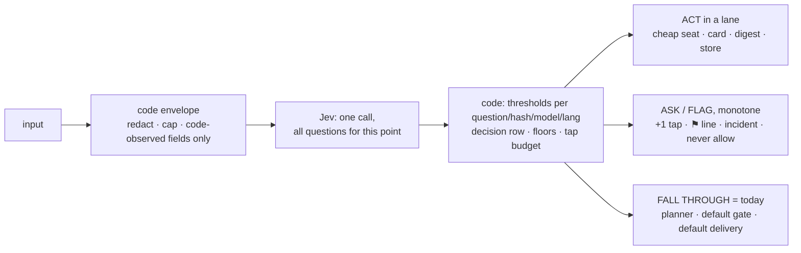

# Jev as System One — a typed decision layer in front of Houge's models

Date: 2026-10-04
Status: **Rev 5 (final for lane 1 planning) — Codex confirmation pass: READY WITH FIXES, the one fix (status verdicts in the label set, §5.9 step 2) applied. Every blocker from both reviews is closed. Next: `writing-plans` for lane 1 slice 1 (§5.0).**

Rev 5 changes: §5.1 spawn ownership (retained promise with a rejection handler, stop-or-supersede on a bounded-wait
expiry, generation-guarded state writes); §5.9 label coverage (all 36 action-proxy runs labelled regardless of Jev's
verdict; shadow reports `pure` for other-tool and no-tool turns separately); §3.2 the `triage` event is written after
the outcome is known; §3.3 `fused` rides the metered-fuse Telegram alert, not an incident.

Rev 4 changes: §5.1 one terminal owner (`finishSuccess`), spawn ownership and the `turn.finished` guard, button
propagation through `ompComplete`; §5.5 the already-saved guard and steered messages; §5.6 Undo restores each row to
its recorded prior state; §5.9 recall against both the observed actions and the human labels, a status bar; §3.2/3.4
denominator vs per-question rows; §3.3 `fused` rides the metered-ceiling incident; §6.1 cold-spawn, failed-pin and
refusal rules for the turn-owned chain.

Rev 3 changes: §3.1 hash of the exact ordered question; §3.2 a denominator row for every turn; §3.3 error kinds and
first-failure incidents; §3.4 table `jev_decisions`; §3.7 golden set deferred to the replay slice; §4.1 monotone rule
scoped to security-bearing decisions; §5 rewritten (ack nudge moves to `submit()`, Jev awaited before `ensureReady`,
posture check, extracted lesson-write service with an adapter-level already-saved guard, photo turns fall through,
Undo as a recorded change set, catch-up line cut, bars sized on the positive class, slice 1 scope); §6.1 turn-owned
chain and escalating error kinds, D10 resolver named as new code; §6.2 enforced metadata-only request shape; §6.3 lane 4
demotion stays shadow until a notification-policy amendment.
Rev 2 changes: §1.2 decision-flow diagram; §6.1 routing table rewritten to Paco's direction (trivial/routine → Kimi →
Gemini, hard → Opus; Codex stays the self-write writer only) with the D10 reader-family resolver and the Antigravity
ceiling watch; the six open questions closed with the defaults (see Rulings).
Author: Paco + Claude
Supersedes the scope of memory stage A2 ("Jev-first decision cascade", `docs/superpowers/specs/2026-10-02-memory-a1-fixes-design.md` §Non-goals): the memory lane is now lane 1 of a general layer, not a memory-only cascade.
Governs: ADR 0029 (new), amendments to ADR 0013, 0014, 0019; the AGENTS.md flat-rate line (Paco's hand).
Evidence: six research reports in `docs/superpowers/research/2026-10-04-jev-lanes/` (Jev capabilities, and one per lane). Every number below comes from those reports, the live DB (read-only, `houge.sqlite`) or the code at `main@6f52dea`.

The repo is public: this spec names memory rows by id only and quotes no personal message text.

## Why

Houge makes many small judgment calls per day: what kind of message this is, which model should answer it, whether a
lesson should be saved, whether a read page carries instructions, whether a notification is worth an interruption.
Today every one of them is either hard-coded or costs a full planner turn on Claude Opus 5.5 (the only seat that sees
the conversation). "好" after a proposal is a 189K-token Opus turn; a one-line preference ("以后别用敬语") is an Opus
turn that may or may not call `lesson_write`; a schedule report reaches Telegram with no urgency judgment at all.

Jev (TypeSafe System One, `jev-1.13.0`) answers typed questions — `choice`, `score`, `noul` — over a JSON state with
calibrated probabilities in ~0.3 s, for $0.042 per million input tokens, and cannot generate text. The 2026-09-26 replay
(374 turns) agreed with the LLM intent classifier 94.2% of the time at confidence ≥ 0.7. Paco's direction (2026-10-02,
restated 2026-10-04): Jev is the first decider for typed judgment calls across Houge, code owns the gates and the
thresholds, the generative models compose inside the lane Jev picked, and the code stays loose — few hand-coded
branches, one decision call per decision point.

The research changed the shape of three of the five lanes (see §2); this spec records what the numbers support, not what
the reference material promised.

## Goals

- One generic decision layer: a question library, one Jev call per decision point, code-owned thresholds, a decision row
  per call, an offline replay harness. Built once, reused by every lane.
- Lane 1 (memory) ships first and proves the layer end to end: a pure memory instruction from Paco is saved without an
  Opus turn and answered with a code-owned card.
- Jev can only add caution. It never produces `allow` or `deny`, never gates a security-bearing action, and every Jev
  failure yields today's behaviour.
- Thresholds come from replay evidence against labelled history, per question and per language, and re-enter shadow
  when the criteria text or the model version changes.
- Every Jev outage (401/403, 422, 429, 529) reaches Paco; none is folded into a silent retry.

## Non-goals

- Jev deciding reconcile verdicts (ADD/UPDATE/SUPERSEDE/DROP) for lessons or facts: separable in theory, but DROP leaves
  no row to calibrate against and reconcile already names the theme.
- Per-turn lesson or tool selection into the planner prompt: under omp lessons, skills and the tool manifest are
  session-level (written at child spawn); lessons are 2.4% of a 28.7k-token turn. Lane 5 is shadow-only (credit).
- `exfil_shape` through Jev: asking "is this a secret" would send the secret to TypeSafe. Stays code (credential-shape
  regex + entropy at the redact seam).
- A new "memory agent" process: `lesson_write` is already code plus two ticks-seat one-shots; the lane calls them.
- Fine-tuning Jev (not offered), local classifiers (embeddinggemma cannot read boundary rules; local LLMs are too slow
  on the 2018 mini), logprob classifiers (omp exposes none).
- SP2 itself. Lane 4 builds the envelope, digest and label SP2's poller will plug into; the poller is SP2.

## 1. Architecture

```
inbound (Paco message | schedule run | incident | radar | later: mail, calendar)
   → code envelope: redacted, capped, code-observed fields only
   → Jev, one call carrying every question for this decision point        System One
   → code: thresholds (per question, per language), floors, fall-through,  gates
           decision row, incidents
   → lane: ticks-seat one-shot | planner (Opus) | code-owned card | digest | store
```

Three layers instead of two. System One answers typed questions; code enforces; System Two (omp seats) composes. The
default path is always reachable: `none`, low confidence, or any Jev failure means today's behaviour, exactly.

### 1.1 Facts about Jev that bind the design (report 00)

- Questions in one request are independent and evaluated in parallel; one answer never conditions another. Pattern:
  one call per decision point carrying every speculative question, code ignores what it does not need (12× cheaper than
  one call per question).
- `confidence` is a pure function of the probabilities (`choice`: `(p_max − 1/n)/(1 − 1/n)`; `noul` has none). The scale
  is 0–1 everywhere; the meaning is per question. Thresholds are per question, per criteria wording, per model version.
  Pin `jev-1.13.0`; aliases move without notice.
- Vendor-listed weaknesses: literal reading, math/dates, indirection, large noisy state, **adversarial content** ("state
  is data … an injected instruction can move the answer"), **option-order bias** (leans to the first option), weaker CJK.
- Limits: 64k tokens state + questions, 32k state + longest question; 80 req/s; errors 401, **422 malformed question**,
  429, **529 overloaded**. Measured latency from the mini 216–403 ms.
- Data: not trained on inputs; hosted in the United States; no published retention period; zero-retention is
  enterprise-only. Houge's egress caps stay and tighten (§4).
- Thin labels: at n≈60 a 90% point estimate proves only ~80% (Wilson 95% lower bound). Lane targets must match the
  sample the lane can collect.

### 1.2 Decision flow (lane 1 as specified; lane 2's `complexity` joins the same call under its own spec)

```mermaid
flowchart TD
  M[Telegram message from Paco] --> AP{"submit(): turn AWAITING_APPROVAL<br/>∧ bare ack (code list)?"}
  AP -- yes --> NUDGE[code nudge card:<br/>tap Approve or /approve id<br/><i>not steered, not queued, Jev never asked</i>]
  AP -- "no (queued turn → startTurn)" --> PRE{posture non-null<br/>or photo turn?}
  PRE -- yes --> TODAY
  PRE -- no --> JEV[Jev, one call ≤ 1.5 s, awaited;<br/>child spawn started, not awaited<br/>lane · complete · scope]
  JEV --> FAIL{Jev skipped: no key / 429 /<br/>timeout / disabled …?}
  FAIL -- yes --> TODAY[ledger row + incident<br/><b>today's path</b>: await spawn, planner on default chain]
  FAIL -- "lane = status ≥ .80" --> STATUS[code-rendered houge_status text<br/><b>no planner turn</b>]
  FAIL -- no --> MEM{lane = memory ∧ conf ≥ .70<br/>∧ p(memory) ≥ .85 ∧ gap ≥ .50?}
  MEM -- "yes, p(pure) ≥ .80" --> LANE[memory lane on ticks seat:<br/>distill → reconcile → save]
  LANE -- saved --> CARD[📒 card · Undo · Ask Houge anyway<br/><b>no planner turn</b>]
  LANE -- nothing durable --> ROUTE
  MEM -- "yes, mixed" --> LANE2[memory lane saves;<br/>already-saved guard armed] --> NOTE["planner turn with<br/>[memory] lesson #N saved; do not save again"] --> ROUTE
  MEM -- no --> ROUTE{"planner seat by complexity<br/>(lane 2: turn-owned chain)"}
  ROUTE -- "hard ≥ .70" --> OPUS[anthropic/claude-opus-5-5:medium<br/>→ antigravity/claude-opus-4-6 → kimi]
  ROUTE -- "routine ≥ .70" --> KIMIM[kimi-code/k3:medium<br/>→ antigravity/gemini-3.1-pro:medium]
  ROUTE -- "trivial ≥ .80" --> KIMIL[kimi-code/k3:low<br/>→ antigravity/gemini-3.1-pro:low]
  ROUTE -- abstain --> DEF[default: Opus chain in month one;<br/>flips to the routine chain once hard-recall ≥ 97%]
  KIMIM -. "think harder / 认真想 / ultrathink,<br/>model error or refusal" .-> OPUS
  KIMIL -. same escalation .-> OPUS
```

The generic layer under every lane:



| Lane | input | act | ask / flag | fall through |
|---|---|---|---|---|
| 1 memory | Paco's message | save lesson, card | — | planner |
| 2 routing | Paco's message | pin the seat chain for this turn | — | default chain |
| 3 security | wall output / plain shell command | — | ⚑ taint line / extra tap | today's gate |
| 4 inbound | report / incident / mail | digest, store | ping now | today's delivery |
| 5 context | Paco's message | shadow: credit only | — | credit all, as today |

On ship of lane 1 this section is copied to `docs/reference/jev-decision-layer.md` and linked from the README.

## 2. Lanes: what the research supports

| Lane | Promise | What Houge's numbers say | Verdict |
|---|---|---|---|
| 1 Triage → memory | skip the heavy LLM for memory instructions | `lesson_write` is code + two Kimi one-shots; the planner only supplies `scope`. Comparator exists: `loop_step.capability = lesson_write` (44 steps, 13 runs / 60 d). Lane is not faster (k3 distill + reconcile 15–25 s vs planner p50 12 s); the win is an Opus turn saved and a deterministic card | **build first** |
| 2 Model routing | cheap model for simple turns | `set_model` mid-session already runs live for failure fallback; routing needs a **turn-owned chain** (today `promptTop` and `retryNextLeg` index the global `cfg.planner`, and Kimi's live error class `other` is terminal) — see §6.1. Zero-tool turns are 28% of Telegram turns but 16% of uncached Opus input; thinking-level routing saves ~0 (100–900 output tokens/turn). Short ≠ trivial: "好" once cost 189K tokens | build second, in the same call as lane 1 |
| 3 Security | pre-execution guardrail | Monotone rule survives: `ask := code_ask ∨ (jev_flag ∧ conf ≥ τ)`. The matcher is not over-asking (12 cards in the omp era; the needless ones are a re-ask bug and a `launchctl list` false positive — code fixes). First real use: `injection_suspected` on reader-wall output, today a planner note that is never ledgered or gated | build third, shadow first |
| 4 Inbound triage | score urgency of the firehose | 2.2 non-Paco items/day today; schedule reports (1.1/day) cost a full planner turn each and reach Telegram with no routing; incidents already have the best urgency model in the system. No digest path exists. SP2 multiplies the volume | build before SP2 |
| 5 Context selection | load only relevant chunks | Session-level blocks; <1% token saving; `needs_memory` loses on latency (embed 26 ms vs Jev 300 ms); 11 ratings all 2–3, no culprit label. Value is credit precision and readiness for stage B | shadow only; feeds stage C |

Each lane gets its own spec, review, plan, build and live gate. This spec fixes the shared foundation (§3), the
invariants (§4), lane 1 in full (§5), and the decisions that bind lanes 2–5 (§6) so they are not re-litigated.

## 3. Shared foundation (built with lane 1, reused by all)

### 3.1 Question library — `src/jev/questions/`

One frozen object per question: `{ id, type, instructions, criteria, options_in_order }`. `criteria_hash =
sha256(exact request JSON of the question as sent: type, instructions, and the criteria as an ordered list of
[option, text] pairs)` — the ordered list, not a key-sorted object, because option order is itself a calibration
variable (order bias, §1.1). A threshold row is used only when its `criteria_hash`, `model_reported` and `lang` all
match; otherwise the decision is `fallback`. Any wording or order edit therefore re-enters shadow. Rules for writing a question:
literal conditions, boundary cases named in the criteria, a `none`/`other` option wherever the set may not cover the
input, the cautious option **first** (order bias then errs toward caution), no negations, no arithmetic or date
comparison (code extracts parts; Jev classifies them).

### 3.2 `decide()` — `src/jev/decide.ts`

```
decide(point: DecisionPoint, state: object, questions: Question[]): Promise<Decision>
Decision = { status: "answered" | "skipped", reason?, answers: Record<id, Answer>, latency_ms, model, lang }
```

- Builds the request (state caps as `intent-question.ts`: 8k-char message, 24k-char request; skip, never truncate),
  calls the client, validates, writes one decision row per question (§3.4), returns answers. It **never** applies a
  threshold: that is the caller's code, so every lane's gate is readable in one place.
- `retries: 0` on every live path; timeout 1,500 ms for turn-blocking decisions, 5,000 ms for shadow calls that are not
  awaited. The metered fuse is checked before each attempt as today (ADR 0019 ceiling covers Jev).
- Every `skipped` reason (`no_key | fused | auth | rate_limited | overloaded | malformed_question | timeout | parse |
  state_too_large | disabled | posture | modality`) is a ledger row; the caller treats it as "no answer" = today's path.
- **Denominator.** The per-point `triage` event is written exactly once per eligible turn **after the attempt or skip
  outcome is known**, including flag-off and state-build skips, with final `status: answered | skipped` and
  `skip_reason`, so coverage is computable even when the flag is off or the state was never built. `jev_decisions` holds **one row per question** for an answered call, and a single row
  with `question_id = NULL, status = skipped, skip_reason` for a skipped one. Stored answer and outcome fields are whitelisted to enums, numbers and ids at the write seam
  (`appendLedgerEvent`, `run-store.ts:1028`): no message text, no provider text, no `detail` strings.

### 3.3 Client additions — `src/jev/jev-client.ts`

`score` and `noul` question types land with lane 2 (slice 1 is `choice` only). Slice 1 changes: new `LlmErrorKind`
values `rate_limited` (429), `overloaded` (529), `malformed_question` (422) — today 429 and every 5xx are folded into
`transport`; 422 is never retried and is a code bug, not an outage. Jev audit rows carry `role = <decision point>`
(`triage`, later `route`, `injection`, `inbound`, `context`) so the per-point rate is readable in `llm_attempt`.

Incidents (alerted, transition-only, flap-damped like every incident; **first failure opens, not a count**):
`jev_auth` (401/403), `jev_rate_limited` (429), `jev_overloaded` (529), `jev_question_invalid` (422, names the
question id), `jev_no_key` (key missing at boot while a lane is armed). `no_key` is a configuration state: it opens its
incident once and the lane runs `skipped{no_key}` until fixed. `fused` uses ADR 0019's metered-fuse latch and its
existing one-per-episode Telegram alert (`metered-ceiling.ts:35`, a direct notification, not an incident); the lane
writes `skipped{fused}` and resumes when the latch disarms, without opening a second incident. The `llm_leg_failing` sweep
ignores `provider = 'jev'` (Jev has its own incidents; no double paging). The daemon builds one Jev client at boot
from the broker key (`TYPESAFE_API_KEY`, broker secret #9); today only the CLI builds one (`cli.ts:343-356`).

### 3.4 Decision rows — table `jev_decisions`

`decision_id, run_id?, point, question_id, criteria_hash, model_reported, state_hash, lang (zh | en | mixed), answers_json
(probabilities / score / noul), confidence, top_prob, margin (p1 − p2), threshold_version, threshold_used, decision
(act | ask | fallback | shadow), outcome_source (llm_label | paco_correction | observed_action | none), outcome_value,
latency_ms, input_tokens, status, skip_reason, created_at`. No message text (ledger invariant); `state_hash` joins replays to
live rows. A lane's write (lesson save) and its decision row land in **one transaction** with the ledger event, so a
crash between save and `finishRun` leaves a readable trail; `ompFail` after a lane save says the lesson was saved.
`mixed`-language rows inherit the `zh` thresholds until they have ≥ 20 labelled rows of their own. `outcome_*` is filled later by the lane's comparator (e.g. the planner's `lesson_write` call, Paco's override tap).

### 3.5 Thresholds — `src/jev/thresholds.ts` + env

A table keyed by `(question_id, criteria_hash, model, lang)` → `{ confidence, top_prob, margin }` with a version. Start
values come from replay (§3.6); each lane names an env override (`HOUGE_JEV_<LANE>_*`) so a bad calibration is an `.env`
edit. A row with no entry for its `lang` is `fallback`. Asymmetry is explicit: the costly direction of each question
(e.g. demoting an urgent item, skipping the planner) carries its own higher bar.

### 3.6 Replay harness — `src/jev/replay-core.ts`, `houge jev replay <point>`

Lifted from `src/jev/replay.ts` (intent-specific today): source rows → `prepare` (rebuild the state as it stood at the
anchor time) → dispatch (budget reservation, Jev call, optional comparator LLM call) → append-only JSONL of ids and
numbers → report. Report per threshold candidate 0.5–0.9: agreement, coverage, confusion matrix, the costly cells, and
the **Wilson 95% lower bound** on agreement, per language. GO/STOP has an INCOMPLETE state for early stops and a
distinct dry-run headline (`tasks/lessons.md`, Jev replay lessons). A permuted-option replay runs on each question
before arming to measure order bias.

### 3.7 Golden set and drift (lands with the replay harness, after labelled states exist)

~30 fixed `(state, question, expected)` pairs per armed question, drawn from the labelled replay set, run by the
invariant sweep at its cadence (≈ $0.10/day at hourly). Agreement below the set's floor, or a reported model id ≠
`jev-1.13.0`, opens `jev_drift` and **auto-disarms every Jev-added behaviour** through a persisted marker (like
`houge.parked`), not an env edit; re-arm is Paco's hand. A `jev_skip_rate` invariant makes a silently dead layer loud.
Not in slice 1: there are no labelled states yet.

### 3.8 Flags

`HOUGE_JEV_ENABLED` (master, default off, in `DISARM_FLAGS`), then one flag per lane (`HOUGE_JEV_TRIAGE_ENABLED`,
`HOUGE_JEV_ROUTE_ENABLED`, `HOUGE_JEV_INJECTION_ENABLED`, `HOUGE_JEV_INBOUND_ENABLED`, `HOUGE_JEV_CONTEXT_SHADOW_ENABLED`),
each with a `shadow | arm` mode where the lane acts. `HOUGE_JEV_SHADOW_ENABLED` (the dormant intent shadow) is retired
in the same change. All documented in `configuration.md`, one section.

## 4. Invariants: what Jev may and may not do (→ ADR 0029)

1. **Monotone safety** (scope: every decision that gates an action, a credential, a write, or an approval — lane 3,
   the Approve-tap paths, and any future gate). Jev output enters such a decision only as
   `ask := code_ask ∨ (jev_flag ∧ conf ≥ τ)`. Decisions that are *not* gates (which seat answers, which lane saves a
   lesson, when a notification is shown) are routing decisions: they fail toward today's path (§4.8), and any change
   that can **delay or suppress** something Paco receives today (lane 4 `digest` / `never`) is a notification-policy
   change that stays in shadow until an explicit amendment authorises it.
   It never produces `allow` or `deny`, never shortens an approval TTL, never clears a taint, never touches self-write,
   the reader wall's existence, the invariant sweep, the kill switch, or `/approve` consumption. Any Jev failure = no
   flag = today's gate.
2. **Cards never show a Jev score, probability, or "safe"/"low" wording.** A Jev-added card is today's card plus one line
   `⚑ flagged: <class>`. A matcher card is never annotated with Jev's view. (Downgrade-by-advice is the human-channel
   hole in the monotone rule.)
3. **Added-tap budget.** `HOUGE_JEV_ADDED_TAPS_PER_DAY` (default 3). Beyond it a Jev ask becomes incident
   `jev_tap_budget` + ledger row, never a card. Alert fatigue weakens every gate at once; false positives are a known
   DoS vector against safeguards.
4. **State is code-observed fact, never model-authored justification.** Parsed command structure, hostnames, flags,
   metadata; never the planner's "this is a safe cleanup script".
5. **Egress.** Approved today (2026-09-25, option A): Paco's latest Telegram message plus the recent thread, under the
   intent-shadow caps. Every state passes `broker.redact` plus credential-shape stripping (`Bearer …`, `ghp_`, `sk-`,
   `AKIA`, 32+-char opaque tokens, heredoc bodies, long quoted literals); `trusted_extract.codes` (OTPs) and links never
   enter a state; `$HOME` and chat ids are normalised. **Third-party web excerpts (lane 3) and Paco's mail or calendar
   fields (lane 4/SP2) are a new egress class and need Paco's explicit approval per lane** before that lane leaves
   shadow; the TypeSafe DPA is read before mail content is in scope.
6. **Jev is a free leg, outside the flat-rate chains.** It generates nothing, so it is not an LLM chain leg; it is
   metered ($0.042/M input, ≈ $0.00015 per decision) and stays under the ADR 0019 ceiling and fuse. Any 4xx/5xx reaches
   Paco as an incident. (Amends the AGENTS.md line: "Default LLM chains are flat-rate subscription legs only …" gains
   "Jev, a non-generative typed decider, sits in front of the chains under ADR 0029; it never gates an action.")
7. **Shadow before arm, per question, per language.** A question is armed only after an offline replay against labelled
   history and a live shadow period whose bar is sized against the measured volume (`tasks/lessons.md`). A failing
   language stays `fallback`.
8. **Fail toward today.** Routing decisions fail to the default lane; security decisions fail to today's gate; triage
   decisions fail to today's delivery. No Jev failure changes behaviour.

## 5. Lane 1 — pre-planner triage, memory + status lanes (A2 proper)

### 5.0 Slice 1 scope

Builds: `decide()` (choice only), the new error kinds and incidents, `jev_decisions`, the `triage` question set, the
memory lane on an extracted lesson-write service, the status lane, the saved card with Undo and "Ask Houge anyway",
the `triage` ledger event, flags, `replay-core` with the lane 1 replay and its labelling command, the live gate.
Deferred to their lanes: `score`/`noul`, the `complexity` question (lane 2; shadow rows for it may ride once lane 2's
spec fixes their shape), the golden set (§3.7), the catch-up line (§5.7), facts and `memory_correct` (phase 2).

### 5.1 Two slots, not one

**Slot A — the ack with an approval pending, in `submit()`.** `PlannerSupervisor.submit` steers any Telegram text into
the live turn while the state is `RUNNING` or `AWAITING_APPROVAL` (`planner-supervisor.ts:219-228`); such a message
never reaches `startTurn`. So the check sits **before the steer branch**: state `AWAITING_APPROVAL` and the text is a
bare ack from a code-owned list (≤ 4 chars: 好 / 嗯 / ok / 是的 / 对 / 👍 / yes …) → the message is neither steered nor
queued; a code-owned nudge card replies ("Tap Approve or send `/approve <id>`"); ledger `ack_nudged {run_id}`. Jev is
never asked; nothing is approved. Any other text in that state is steered as today.

**Slot B — triage, in `startTurn`.** After `resolveText`, the supervisor starts the child spawn (`ensureReady`)
**without awaiting it**, awaits the Jev decision (timeout 1,500 ms), and only the planner paths then await the spawn:
a pure memory save or a status answer needs no child and must not fail because omp is down (`omp_unavailable` has
fired live). Posture is checked first: a non-null `SupervisorDeps.posture()` (disarm / park / kill) means `skipped:
posture` and today's path — the lane must honour the gate the bridge applies to every tool (`bridge-handler.ts:170`).
Steered messages never reach `startTurn` and are never triaged; schedule-born runs skip triage.

```
startTurn
  ├─ posture non-null → skipped{posture} → today's path
  ├─ photo turn (modality ≠ text) → skipped{modality} → today's path        (phase 1; the planner text is an image digest)
  ├─ spawn child (not awaited)  ‖  Jev: lane · complete · scope   (one call, ≤ 1.5 s; concurrent)
  ├─ Jev skipped (any reason) → ledger + incident → await spawn → planner as today
  ├─ lane=status ∧ conf ≥ .80 → code-rendered houge_status text → finishLane            ■ no planner
  ├─ lane=memory ∧ conf ≥ .70 ∧ p(memory) ≥ .85 ∧ gap ≥ .50
  │     ├─ p(pure) ≥ .80 → memory lane (ticks seat)
  │     │     ├─ saved → 📒 card [Undo] [Ask Houge anyway] → finishLane                   ■ no planner
  │     │     └─ nothing durable → await spawn → planner as today (no card)
  │     └─ mixed → memory lane saves → await spawn → planner prompt with
  │           "[memory] Lesson #N (theme) was just saved from this message; do not save it again."
  └─ else → await spawn → planner as today
```

**One terminal owner.** `finishSuccess` (`planner-supervisor.ts:943`) stays the only completion path. A lane turn
sets `turn.lastText = <card text>`, `turn.laneButtons = <buttons>`, records the user chat turn (as `startTurn` does
after `ensureReady` today), awaits `settleStart()` (below), and resolves `turn.done("end")`; `settle()` then runs
`finishSuccess` as for any turn: `tool_calls` reads 0 from the untouched budget, the assistant chat turn is recorded,
`outcome.complete` is called once. `TurnOutcomeSink.complete` gains an optional `buttons` field; `ompComplete`
(`core-worker.ts:2285-2304`) passes it to `enqueueFinalReportNotification`, which already accepts `buttons`
(`run-store.ts:5417-5434`) — today that call passes only text, path and attachments. Failure inside the lane after Jev
answered (Kimi error, store error) → `failTurn` with a code-owned text that names any lesson already saved.

**Spawn ownership.** `startTurn` retains the promise returned by `ensureSession(0)` and attaches a rejection handler
immediately (the join loop in `ensureSession`, `:518-520`, re-awaits `startInFlight`, so a rejected spawn would
otherwise reject an un-awaited outer promise; `startInFlight` owns only the inner `spawn().finally(...)`). A lane
completion waits for that promise to settle; if its bounded wait (`ABORT_GRACE_MS`) expires, it stops or supersedes the
start (`stopSession` / generation bump) and waits for the cleanup before resolving `done("end")`. Spawn results may
update supervisor state only while their generation remains current (`this.gen`, the guard every child frame already
passes); `failTurn` and `ensureReady` ignore a finished turn (`turn.finished`, the guard `steer` uses, `:297`).
Planner paths await `ensureReady(turn)` as today, which joins the in-flight start.

### 5.2 State (metadata beyond the approved egress; no new text)

`latest_message` = `userText` (Paco's words; for a photo turn the caption, but phase 1 skips photo turns),
`recent_turns` (as `buildJevIntentRequest`, same 8k / 24k caps, broker-redacted), `modality`,
`last_houge_turn: { kind: clarify | answer | lesson_saved | memory_card | approval_card, age_s }`,
`pending: { memory_change_id?: string, rating_ask: bool }`, `last_turn_tools: string[]`.

### 5.3 Questions (criteria drafts; final wording and order frozen in the lane plan and hashed)

- `lane` (choice; options **in this order**: `none`, `status`, `memory` — the fall-through option first):
  `none` — "Everything else: a question, a task, a lookup, small talk, a bare acknowledgement such as 好 / 嗯 / ok / 👍 /
  是的 even right after Houge saved or proposed something, an answer to Houge's question, or a message about Houge's
  code or schedules."
  `status` — "`latest_message` asks whether Houge restarted, which build or code is live, or whether it is running
  normally; nothing else."
  `memory` — "`latest_message` tells Houge how to behave from now on, states something about Paco to remember, or
  corrects something Houge believes. Signals: 以后 / 从现在起 / 记住 / 不要再 / 别再 / always / never / from now on /
  remember / prefer, or a correction of Houge's previous reply in `recent_turns` that applies to future replies too."
- `complete` (choice; **`mixed` first**): `mixed` — "`latest_message` also asks something, requests work, or continues
  a task." `pure` — "It contains only the preference, fact or correction; nothing asks a question, requests work, or
  expects more than a confirmation."
- `scope` (choice): `ask` — "about how Houge replies in conversation." `research` — "about how Houge searches, which
  sources it trusts, or how it cites."

Theme is **not** asked: `reconcileLesson` names it from the closed list and the store enforces it.

### 5.4 Thresholds (start values; replay-verified before arm; env-tunable)

Route-and-skip (memory): `confidence ≥ 0.7 ∧ p(memory) ≥ 0.85 ∧ p(memory) − p(none) ≥ 0.5 ∧ p(pure) ≥ 0.8`.
Write-then-inform: the same without the `pure` bar. Status: `p(status) ≥ 0.8`. Else fall through.
Env: `HOUGE_JEV_TRIAGE_MIN_CONF`, `HOUGE_JEV_TRIAGE_MIN_PURE`, `HOUGE_JEV_TRIAGE_MIN_STATUS`.

### 5.5 The memory lane — an extracted lesson-write service

`reconcileAndSaveLesson` is private and the `lesson_write` adapter is assembled inside the loop tool with the claim
objective, the prior-answer anchor, the recent user turns and the phrase checker (`core-worker.ts:2524-2561`). Slice 1
**extracts one run-scoped service**, `CoreWorker.runLessonWrite(claim, { scope, source })`, that builds exactly that
adapter (`feedback = claim.contract.objective`, never the planner text; `priorAnswer` from the lesson anchor;
`threadUserTexts`; `srcContains`; `scheduledRun`; the ticks-seat one-shots for distill and reconcile) and calls
`reconcileAndSaveLesson`. The loop tool and the lane are its two callers; `source` is `loop` or `lane`. Every existing
gate therefore applies: the code-owned phrase refusal, the distill "durable?" verdict, reconcile, the 240/120 caps,
`lesson_cross_theme`, `lesson_theme_unknown`, plus the posture check of §5.1.

**Already-saved guard (replaces the `ranOnce` idea, which guards only `EVOLUTION_TOOLS`, `core-worker.ts:231, 2355`).**
The service records `turnState.lessonSavedThisTurn = { id, theme, change_id }`. The adapter takes
`alreadySaved?: { id }` and, when set, returns the code-owned digest `{ saved: false, reason: "already_saved_this_turn",
lesson_id }` before any LLM call. A mixed-path planner that calls `lesson_write` anyway spends nothing and cannot mint a
second row or an UPDATE that supersedes the card's lesson. The `[memory] saved …` prompt line stays as advice only.
**Steered messages:** a Telegram message steered into a live turn is a merged run under the parent's claim
(`steer`, `:290-296`); `lesson_write` in that turn anchors on the parent's objective today, so a second preference
arriving by steer cannot become a correctly anchored lesson with or without the lane. The guard is per turn; in a
mixed lane turn a steered second preference is therefore answered by the planner without a save, and the next turn
can save it. Documented, accepted (steers are rare and this is today's anchoring).

A `saved: false` result from the lane (nothing durable, phrase refusal, cap) produces **no card**: the turn falls through
to the planner as if Jev had said `none`, with the reason in the `triage` row.

Phase 2 (own slice): fact writes ("记住我…") and `memory_correct` ("忘掉那个": code search for candidates, Jev
`choice` over ≤ 5 ids, the Approve card unchanged — `memory_correct_write` stays `destructive`).

### 5.6 Reply: code-owned card through the rich renderer; Undo as a recorded change set

```
📒 Saved lesson #51 · hygiene (updated #44)
<lesson text, escaped>
AVOID: <avoid text>
[↩️ Undo]  [↪ Ask Houge anyway]
```

- **Change set.** `saveReconciledLesson` can supersede a target and prune at the scope cap (`pruneScopeOverflow`,
  `run-store.ts:1490`). The lane records `lesson_changes { change_id, run_id, chat_id, new_id, superseded_id?,
  pruned_ids[], created_at, undone_at }` (new table; `memory_changes.kind` has `CHECK (kind IN ('fact','wiki'))`,
  `run-store.ts:6561`, and SQLite cannot alter a CHECK in place — a separate table is the smaller migration).
- **Undo** = one transaction, compare-and-set: valid only while `new_id` is still active; retires `new_id` and restores
  each affected row to its **recorded prior state**: `superseded_id` from `superseded` → `active`
  (`reactivateLesson`, `run-store.ts:1373`, which accepts only `superseded`), each of `pruned_ids` from `pruned` →
  `active` through a new conditional `unpruneLesson(id)` (`WHERE status = 'pruned'`); a row whose status moved since
  (changed by a later write) is left alone and named in the reply. The restore may exceed the scope cap by the pruned
  count until the next write re-prunes; accepted and stated. Sets `undone_at`, ledgers `lesson_change_undone`. If `new_id` was changed since (a later planner write superseded it) the tap gets a code-owned
  "already changed since" reply and nothing moves.
- **Callbacks** use a new prefix `memlane:undo:<change_id>` / `memlane:ask:<run_id>`, authorised like `selfwrite:*`
  (Paco only), idempotent on redelivery. "Ask Houge anyway" re-submits the same text as a planner turn with triage off
  (idempotency key suffixed) and is **the override label** for calibration.

### 5.7 Transcript: the session seed already covers the gap; no catch-up line in slice 1

A saved lesson changes the system-prompt fingerprint, so the next turn triggers A1's lesson-change reset
(`planner-supervisor.ts:523, 684-704`), whose session seed is built from the recent Telegram user turns, ≤ 300 chars
each (`session-seed.ts:21-28`) — including the skipped turn, because the lane records both chat turns (§5.1). The
transcript therefore sees the exchange without a second mechanism, and the spec no longer claims that no message text
is repeated: A1's seed repeats it by design. The status lane changes no fingerprint and leaves no gap worth closing
(read-only answer). A catch-up line returns only if a later lane skips the planner without a reset.

### 5.8 Ledger, incidents, flags

Ledger event `triage` (new `LedgerEventType`; required `status, lane, complete, scope, confidence, top_prob, margin,
lang, decision, skip_reason?`; never text) on every Telegram turn start, written with the `jev_decisions` row; `ack_nudged`,
`lesson_saved {lesson_id, change_id, source}`, `lesson_change_undone`. Incidents: §3.3's five, plus `triage_overrides`
(≥ 3 "Ask Houge anyway" taps in 7 days → incident and **auto-disable the lane to shadow** through the persisted
marker). Flag `HOUGE_JEV_TRIAGE_ENABLED=off|shadow|arm` (default off) under the master `HOUGE_JEV_ENABLED`.

### 5.9 Calibration and rollout (bars sized on the measured volume)

**Universe.** The comparator label `loop_step.capability` exists since 2026-07-02: **288 Telegram runs**, of which
**36 called `lesson_write`** (22 lesson-only, 14 with other tools; 16 saved a lesson), 13 in the last 60 days, 6 since
the omp cutover. Agreement over all 288 is dominated by ~250 `none` turns and proves nothing about the positive class;
the bars below are stated per class.

1. **Offline replay** (`houge jev replay triage`, `replay-core` filtering `runs.source = 'telegram'` and
   `created_at ≥ 2026-07-02`): Jev over the 288 turns; the first comparator is the planner's observed `lesson_write`
   call (an action, not a purity label).
2. **Human labels** (one sitting, ≈ 80–100 items, shared with lane 4's sitting): Paco labels every turn Jev called
   `memory` at any confidence, **every turn Jev called `status` at any confidence**, **all 36 observed `lesson_write`
   runs regardless of Jev's verdict**, and a 40-turn random sample of the remaining `none` verdicts, for `memory?
   status? pure? scope?`; overlaps are deduplicated before n is reported.
   These, not the action proxy, decide the costly cells.
3. **GO bar, per language (zh / en; `mixed` inherits zh).** Two positive sets, both reported: the 36 observed
   `lesson_write` runs (an action proxy) and the human-labelled positives from step 2 (which also labels all 36 runs for
   `memory? pure? scope?`, so a run where the planner saved but Paco says "not a memory instruction" counts against
   the proxy, not against Jev):
   - recall of `memory` ≥ 0.80 on each positive set, with n and the Wilson 95% lower bound (n = 36 → ≈ 0.65) shown;
   - precision of `memory` verdicts ≥ bar ≥ 0.85 against the human labels, with its lower bound and n;
   - **zero** `pure` verdicts ≥ bar on the 14 mixed-tool runs and on the human-labelled `none` sample (the costly
     cell); the `none` sample is a random 40, not the whole class — the shadow (step 4) watches the rest;
   - coverage of confident verdicts ≥ 0.50 of the human-labelled positive class;
   - **status lane:** Paco labels every `status` verdict at any confidence (historically `houge_status` ran twice, so
     expect a handful); arm only with precision 1.0 on n ≥ 5, else status stays shadow while memory arms.
   Cost ≈ $0.04. INCOMPLETE on an early stop; a dry run has its own headline.
4. **Live shadow** (`shadow`): rows only; **the replay is the primary evidence, the shadow is a false-positive watch**:
   ≥ 14 days with zero `pure` ≥ bar on any turn whose planner used a tool other than `lesson_write`; the shadow
   report lists `pure` verdicts separately for other-tool and no-tool planner turns, and both groups stay under watch
   (a no-tool turn can still be a question the planner answered from context); and ≥ 5 planner `lesson_write` calls
   observed with a Jev row (≈ 25 days at 13 / 60 d). "Matched" = a turn with both a `triage` row
   and a completed planner run.
5. **Arm**, per language. Live gate `scripts/live-gate-jev-triage.mjs`: a pure memory instruction → saved card, no
   planner request (`llm_attempt` has none for the run), `lesson_changes` row; Undo tap → rows restored, `undone_at`
   set; a mixed one → saved + planner reply carrying the prefix, a forced second `lesson_write` returns the
   already-saved digest with no Kimi call; a bare ack **steered** into an `AWAITING_APPROVAL` turn → nudge card, no
   steer, nothing approved; status question → code text, no planner request; posture parked → `skipped{posture}` and
   the planner answers; Jev key removed → `skipped{no_key}`, incident, planner as today; a 429 stub → `jev_rate_limited`
   on the first failure. Every case asserts the ledger row, not only the reply.
6. **After arming** the only live positive label is the override tap; the replay re-runs monthly against the growing
   `lesson_write` history, and `triage_overrides` is the drift signal.

**Build note (2026-10-06).** `CALIBRATED_ROWS` (`src/jev/calibration.ts`) ships empty, so the lane cannot act until
Paco commits rows after the step 1 to 3 report. The memory lane arms on the rows `lane`, `complete` and `scope`; the
status lane arms independently on a distinct pseudo-row `question_id: "lane:status"` (criteria hash = `lane`'s), so a
row for one never arms the other. `HOUGE_JEV_CALIBRATION_FILE` is gate-only: outside `HOUGE_JEV_GATE=1` a set file caps
`arm` at `shadow`. The replay universe measured 293 turns (not 288) on 2026-10-06.

### 5.10 Honesty notes

- Latency: +0.3 s typical, +1.5 s worst case on every warm Telegram turn (the child idles up to 1 h, so the spawn is
  rarely the long pole); on a cold spawn the Jev call is hidden behind it. The memory lane itself is not faster than
  the planner (Kimi distill + reconcile ≈ 15–25 s vs planner p50 12 s): the win is an Opus turn saved and a
  deterministic, undoable card. A faster ticks leg is a config choice.
- Volume: ~1.7 Telegram turns/day, 13 lesson writes per 60 days. Lane 1's value is the proven layer and the labelled
  history it starts, as much as the saved turns.

## 6. Decisions binding lanes 2–5 (each still gets its own spec)

### 6.1 Lane 2 — model routing

- One `choice` question `complexity` (`hard | routine | trivial`, `hard` listed first) **in the same startTurn call as
  lane 1**. The instructions judge the task a short reply commits Houge to, not the reply ("好" after a proposal is the
  proposal's difficulty). State adds two code-owned booleans: previous turn used tools; previous Houge turn asked or
  proposed.
- **Paco's direction (2026-10-04):** Claude is reserved for hard and ad-hoc work; routine and trivial turns run on the
  other subscription seats. **This needs a turn-owned chain, which does not exist today**: `promptTop` pins
  `cfg.planner[sessionLeg]`, `retryNextLeg` walks `cfg.planner[turn.legIndex]`, `startSession` sets `legIndex` from the
  spawn leg (`planner-supervisor.ts:435, 486-496, 544`), and `setModel` takes one model (`planner-session.ts:92-95`).
  Lane 2 introduces `Turn.chain: ModelString[]` chosen in `startTurn` (default `cfg.planner`); `promptTop` pins
  `chain[0]`, `retryNextLeg` walks `chain`, `legIndex` indexes `chain`, `noteActualModel` audits against it, and the
  next turn's reset to `cfg.planner[sessionLeg]` is unchanged. Three exact rules: (i) **cold spawn** — the child always
  spawns on `cfg.planner` (omp rejects an unknown `--model` at start; `startSession`, `:539-560`), and the routed
  chain is applied by the first `set_model` in `promptTop`, the same frame the top-string reset uses; (ii) **failed
  pin** — `planner_model_reset_failed` keeps today's behaviour (answer on the restored model, incident) and marks the
  decision row `pin_failed`; no escalation is attempted on a child that just refused a pin; (iii) **refusal** — only
  omp's classified `model_refusal` frame counts (`classifyOmpError`), never a text heuristic over a normal answer.
  The per-turn chains:

  | Jev `complexity` | planner chain for the turn |
  |---|---|
  | `hard` ≥ 0.70 | `anthropic/claude-opus-5-5:medium` → `google-antigravity/claude-opus-4-6:medium` → `kimi-code/k3:low` (today's chain) |
  | `routine` ≥ 0.70 | `kimi-code/k3:medium` → `google-antigravity/gemini-3.1-pro:medium` |
  | `trivial` ≥ 0.80 | `kimi-code/k3:low` → `google-antigravity/gemini-3.1-pro:low` |
  | abstain / Jev failure | the hard chain in month one; flips to the routine chain once the replay and a week of live rows show hard-recall ≥ 97% at the bar (`HOUGE_JEV_ROUTE_ABSTAIN=hard|routine`) |

  Codex is unchanged: `codex exec` is the self-write writer only; no chat turn is ever routed to it
  (`openai-codex/gpt-5.5` stays a reader and judge seat).
- Escalation to the hard chain mid-turn (the `retryNextLeg` frame, one ~50K cache write): `think harder` / `认真想` /
  `ultrathink` by regex before Jev; the planner asking for it through a code-owned marker; and **on a routed turn, an
  error of kind `other` or a refusal from the cheap chain** — today `RETRYABLE_ERROR_KINDS` is `{quota, auth,
  transport, timeout, model_missing}` (`omp-frames.ts:66`) and Kimi's three live errors are `other`, so without this
  rule a routed turn would end instead of falling back; the escalation is audited (`routed_escalation {from, to,
  kind}`) and counts against the route's calibration. A rating ≤ 1 on a routed turn is an override label.
- **D10 resolver (amends ADR 0028 D10; new code).** `reader[0]` is `gemini-3.8-flash`; a routine turn that falls to
  Gemini and then reads the web would collapse planner and reader onto one family on most fallback turns. Today the
  planner family only *marks* `family_collapse` on the audit row (`omp.ts:115`, `registry.ts:194`); nothing reorders.
  Lane 2 adds the reorder in `oneShotAdapter` (`opts.chain` rotated so the first leg whose family differs from the
  planner's **current** family — Kimi or GPT-5.5 — runs first); `wall_collapse` stays for the case where no
  cross-family leg succeeds.
- **Antigravity ceiling.** Gemini, Opus 4.6 fallback, the reader and media all draw on the Antigravity weekly quota
  (a watch item in the state block). The live gate records per-provider request counts for a week; the abstain flip
  waits for that week.
- Replay label (proxy, code-owned): `hard` if ≥ 3 loop steps or any `self_write_* | lesson_write | memory_correct_write`
  or output > 1,500 tokens; `trivial` if 0 steps, output < 400, one request; else `routine`. Arm bar: hard→trivial or
  hard→routine ≤ 3% of confident calls, coverage ≥ 50%, Kimi TTFT p90 recorded on real turns (29.5 s seen once).
- v2 (SP3's quota invariant): a daily tick stores Anthropic and Antigravity 7-day utilisation (`omp --profile houge
  usage --json`, never the profile DB); at ≥ 0.8 on Anthropic the abstain default is forced to the routine chain.

### 6.2 Lane 3 — security: injection flag, then plain-command risk

- First: `injection_suspected` (choice, `instructions_present` first) on reader-wall output (web now, mail in SP2).
  State: `{tool, source_host, digest, excerpt ≤ 6k}` minus `trusted_extract.codes/links`. Effect:
  `contains_instructions := reader_flag ∨ jev_flag`, ledger `read_flagged{source, by}`, and a taint line on every
  external-write or destructive card for the rest of the run. Jev here is a closed-enum Q-LLM-shaped component
  (ADR 0014) from a third model family.
- Second, shadow-first: `risk` (`score`) on bash commands the matcher labels `plain`. State = parsed segments with
  heredoc bodies and long literals replaced by `<opaque:N>`, hostnames kept, broker-redacted, plus `matcher_label` and
  the run's prior tool sequence. Never the planner's justification. At τ: a tap labelled `⚑ flagged: <class>`. Evidence
  bar: ≥ 1 true D12-list miss caught per month at ≤ 1 added tap/day.
- **Until Paco approves the new egress class (ruling 3), lane 3 runs on an enforced `code_metadata_only` request
  shape** — `{tool, source_host, bytes, reader_flag, link_count, code_count}` and no excerpt — built by a separate
  function whose output is asserted in tests against the actual outbound body; "shadow" alone does not stop a request.
- Not with Jev: `exfil_shape` (code), `blast_radius` on self-write (code can compute it from the diff).
- Arm bar (ADR amendment text, §7): ≥ 4 weeks shadow, ≥ 200 scored events per language, added-tap rate ≤ 1/day with ≥ 1
  confirmed true catch, per-language precision reported, golden set in the sweep.
- Code fixes found on the way, independent of Jev and each its own exact, tested rule: suppress the
  repeated-fingerprint re-ask (4 × `git push` in 3 h); a read-only `launchctl list|print` whitelist — this one
  *removes* an existing tap, so it ships only with a matcher test that pins the exact argv shapes it admits.

### 6.3 Lane 4 — inbound triage (gate for SP2)

- One code-owned `TriageItem` envelope per item (`class, origin: code | model_output | untrusted, title ≤ 200,
  snippet ≤ 300, sender_known, deadline_min, repeat_24h, local_hour, paco_active_30m, language`), built by the producer,
  never by a model.
- Questions: `needs_paco` (`now | digest | never`, `now` first), `kind` (`risk | action_required | fyi | noise`),
  `needs_llm` (yes/no). Lanes: now (rich card with `wrong urgency` and `open` taps), digest, store (`/inbox`), llm
  (untrusted → reader seat only). Nothing is discarded; calibration needs the row.
- Asymmetric thresholds: interrupt at ≥ 0.6, **downgrade only at ≥ 0.85** (Gmail Priority Inbox tuned false negatives
  3–4× rarer than false positives). **Demotion (`digest` / `never`) is a notification-policy change, not a monotone
  one** (§4.1): it stays in shadow — rows and a labelled morning list, nothing suppressed — until an explicit
  amendment to the notification rules (ADR 0017 / 0024) authorises it per class. Mandatory-now floors outrank the
  storm cap: an item a floor marks `now` is sent even when the 6-per-hour fold is active.
- Seven code floors Jev cannot cross: kill/park/disarm; approval cards never triaged; supervisor-class incidents
  (`SUPERVISOR_ALERT_KINDS`, `stuck_run`, `heartbeat_gap`, `disk_free_low`, auth `llm_leg_failing`) always now;
  untrusted origin picks a lane, never an action; `deadline_min` before the next digest → now; > 6 `now` sends in 60 min
  fold into the digest; triage's own outputs are never triage inputs.
- Build before SP2: `triage_items` + envelopes for the four existing classes + `/inbox`; the `wrong`/`open` taps and
  label store; offline replay plus one ~80-item labelling sitting with Paco; a generic digest tick (08:00 Sydney,
  idempotent per date, grouped by `kind`, cap 20 lines) — none exists today, AI日报 is a planner turn.
- Shadow bar per class: ≥ 100 labelled items and ≥ 14 days, agreement ≥ 85% on now-vs-not at conf ≥ 0.7, slice ≥ 60%,
  **no missed `now`**. Incidents never reach 100 and stay floor-driven; schedule reports take ~3 months; mail a week.

### 6.4 Lane 5 — context relevance (shadow, credit)

- One `context_select` call per Telegram turn, parallel to the embed, never awaited: `theme_time`, `theme_sources`,
  `theme_self` (yes/no each; `tasks` is known by code from `source === "schedule"`; format, hygiene, honesty are
  always-on) plus `skill_applies_<name>` per active skill with its `when:` line as the criteria.
- No prompt change in v1. Outputs: ledger `context_select`, replay with flight-recorder labels (tool calls, URL/date
  patterns in replies — not model opinions), and credit = in-prompt ∧ relevant (`relevant_lesson_ids` beside
  `lesson_ids`; today's credit when Jev is down) behind `HOUGE_CONTEXT_SELECT_CREDIT`. ADR 0005 line: "credit = in
  prompt and judged relevant, or in prompt when no judgment exists."
- Regression detector: a `lesson_write` whose theme was `out` the turn before → `context_select_miss`; ≥ 2 in 7 days
  opens an incident. Low confidence = include (inclusion is the safe direction).
- Next: skills out of the system prompt (≈ 39% of it) once the shadow passes or omp-native `--skills` is verified.
  Tools: only after an omp probe for per-turn toggling.

## 7. ADR changes

- **ADR 0029 (new): Jev as System One.** The layer, the eight invariants of §4, the lane order, the evidence bars.
- **ADR 0013 amendment:** the composition rule gains a System One stage: "code owns the gates, Jev answers typed
  judgment calls under code-owned thresholds, the model composes between them". Monotone rule.
- **ADR 0014 amendment:** Jev as a closed-enum component beside the reader wall (lane 3); the wall's existence is never
  Jev's to decide.
- **ADR 0019 amendment:** Jev is the one metered leg, treated as free by Paco, under the existing ceiling and fuse;
  "dormant" becomes "active for Jev only"; 4xx/5xx are incidents.
- **ADR 0005 amendment (with lane 5):** credit definition.
- **AGENTS.md** (Paco's hand): the flat-rate invariant line, text in §4.6.

The amendment paragraphs are written into the prior ADRs on ship of lane 1 (docs sync), with index rows.

## 8. Testing

- Unit: question hashing over the ordered request (reordering options changes the hash); `decide()` skip reasons and
  the denominator row; client 422/429/529 → `malformed_question | rate_limited | overloaded` and first-failure
  incidents; threshold lookup by `(question, hash, model, lang)` with `fallback` on a missing language and `mixed`
  inheriting `zh`; the lane 1 verdict function over probability vectors (each bar at its edge); the extracted
  lesson-write service used by the tool and the lane with identical anchors; the already-saved guard returns the digest
  with zero LLM calls; `saved:false` → no card; photo turn → `skipped{modality}`; posture → `skipped{posture}`; Undo
  compare-and-set (active → restored incl. pruned rows; superseded since → "already changed", nothing moves);
  `submit()` ack nudge in `AWAITING_APPROVAL` (not steered, not queued, nothing approved) and a non-ack still steered.
- Integration (hermetic, stubbed Jev via `fetchImpl` + stubbed omp session): Jev awaited before the spawn is awaited;
  a pure save completes with the child never prompted and the spawn left idle; `finishLane` settles `runTurn`; fall-through
  on every skip reason; auto-disable to shadow after three overrides through the persisted marker; the `triage` row is
  written when the flag is off.
- Replay: deterministic over a fixture DB; INCOMPLETE on early stop; dry run headline distinct from a verdict.
- Each test encodes why the behaviour matters (a `pure` false positive swallows a question; a skipped Jev call must
  cost nothing; a card must never show a score).

## 9. Risks accepted

- Jev reads literally and is steerable by injected text; every lane keeps the label advisory or monotone, so steering
  degrades quality, never safety.
- US-hosted retention of Paco's chat text under a self-serve account (already accepted 2026-09-25 for the same
  envelope); new egress classes wait for explicit approval.
- A `pure` false positive swallows a question for one turn: strict bar, override tap, auto-disable, and the A1 session
  seed carrying the exchange into the next transcript.
- Thin labels: bars are set at what the sample can prove; a lane that cannot reach its sample stays shadow.

## Rulings (Paco, 2026-10-04)

1. Lane 1 phase 1 = lesson writes plus the zero-LLM `status` lane (`lane: status` → code-rendered `houge_status` text);
   facts and `memory_correct` in phase 2.
2. Routing: trivial and routine → Kimi → Gemini (Antigravity); hard → Opus; Codex stays the self-write writer only
   (§6.1).
3. Egress: web excerpts (lane 3) and mail subject + snippet (lane 4) are **not approved yet**; those questions run
   shadow-only on code-side state until Paco approves per lane, after reading the TypeSafe DPA for mail.
4. Added-tap budget 3/day.
5. Lane 4 digest: one card at 08:00 Sydney next to the 日报; quiet hours 23:00–07:00 Sydney → digest unless a floor.
6. One ~80-item labelling sitting before lane 4's shadow.

## Review record

- **Codex design pass on Rev 2 (2026-10-04, `codex exec -s read-only`): NOT READY** — 9 BLOCKERs, 3 RISKs, 1 NIT. All
  verified first-hand and accepted: turn completion path (§5.1 `finishLane`), private `reconcileAndSaveLesson` and the
  adapter's anchors (§5.5 service), `ranOnce` guards only `EVOLUTION_TOOLS` (§5.5 already-saved guard), seed/catch-up
  duplication and claim-before-dispatch (§5.7 cut), no per-turn chain (§6.1 `Turn.chain`), D10 marks but never
  reorders (§6.1 new code), lane 4 demotion vs the monotone rule (§4.1 scope, §6.3 shadow), `criteria_hash` without
  option order (§3.1), bars not label-backed (§5.9 human labels, per-class bars); outage contract and `triage` event
  type (§3.3, §5.8), Undo partial reversal (§5.6 change set), lane 3 shadow egress (§6.2 enforced shape), slice scope
  (§5.0). Nothing rejected. Codex's "44 vs 13" is lifetime vs 60-day (44 steps / 36 runs; 19 / 13 in 60 d), not a
  contradiction.
- **Senior review against the live system on Rev 2 (2026-10-04, subagent; probed `main@8f55045`, `houge.sqlite`, `.env`
  names, omp 18.4.4 source): NOT READY** — 4 BLOCKERs, 8 WARNINGs, 7 SUGGESTIONs, 14 claims verified correct. All
  accepted: the ack nudge is unreachable in `startTurn` because `submit()` steers during `AWAITING_APPROVAL` (§5.1
  slot A); `ranOnce` (as above); per-turn chain and Kimi's `other` error class (§6.1); bars unsized against 288 / 36 /
  13 per 60 d (§5.9). Warnings folded: photo turns (`userText`, phase 1 skips them), posture bypass, Undo schema and
  `complete()` buttons, Jev before `ensureReady`, catch-up line redundant with A1's seed, error kinds and the
  failing-leg sweep, replay universe filter, warm-turn latency. Suggestions taken: `jev_decisions` name, same-transaction
  rows, `mixed`-first order and `mixed` language rule, persisted disarm marker, monthly re-replay, hermetic seams named.
  Not taken: dropping the `status` lane (ruling 1 stands; it has its own threshold and the replay reports it separately).
- **Codex re-pass on Rev 3 (2026-10-04): NOT READY** — 7 closed, 6 partial, 2 new blockers; all re-verified:
  `newDeferred` accepts only `"end" | "abort"` and `settle()` → `finishSuccess` is the terminal owner (§5.1 now resolves
  `done("end")` and lets `finishSuccess` complete); `ompComplete` drops `buttons` although `enqueueFinalReportNotification`
  accepts them (§5.1 propagation); an un-awaited spawn is owned by `startInFlight` but could settle after the turn
  (§5.1 `settleStart()` + `turn.finished` guard); steered merged runs vs the per-turn guard (§5.5 documented);
  `pruneScopeOverflow` sets `pruned` while `reactivateLesson` restores only `superseded` (§5.6 per-state restore);
  recall measured on the action proxy only and no status bar (§5.9); `fused` unnamed and denominator vs per-question
  rows (§3.3, §3.2); cold-spawn / failed-pin / refusal rules for the turn-owned chain (§6.1).
- **Scoped Codex re-pass on Rev 4 (2026-10-04): NOT READY** — 5 closed (terminal owner + buttons, steered message,
  Undo per state, turn-owned chain rules; no new blocker), 2 partial (label coverage, denominator timing + fuse alert
  shape), spawn ownership still open (a voided `ensureSession` rejects through the join loop; a bounded `settleStart`
  does not cancel a spawn). Rev 5 applies Codex's exact replacement sentences verbatim.
- **Codex confirmation pass on Rev 5 (2026-10-04): READY WITH FIXES** — spawn ownership CLOSED, denominator and fuse
  CLOSED, one OPEN consistency item (step 3 needs `status` labels step 2 did not collect) — fixed in place. The spec is
  cleared for the lane 1 slice 1 plan.
